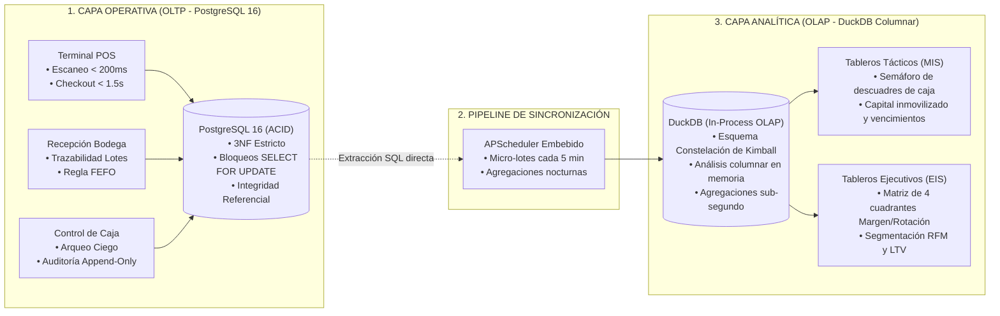

# ⚡ Quantix — Intelligent Retail Operating System

<div align="center">

[](https://github.com/)
[](docs/negocio/analisis_organizacional.md)
[](docs/arquitectura/diseno_arquitectura_datos.md)
[](backend/)
[](frontend/)

<p align="center">
  <strong>Ecosistema integral de Punto de Venta (POS) de alta velocidad, rotación inteligente de inventario FEFO, auditoría ciega de mermas y analítica de rentabilidad en tiempo real.</strong>
</p>

[Explorar Documentación](#-documentación-fundacional) •
[Arquitectura del Sistema](#-arquitectura-tecnológica) •
[Módulos Funcionales (Specs)](#-ecosistema-de-especificaciones-spec-kit) •
[Primeros Pasos](#-puesta-en-marcha-rápida)

</div>

---

## 🎯 Declaración del Problema & Misión de Quantix

En el comercio minorista moderno, las fugas de capital ocurren de forma silenciosa a través de cuatro frentes desatendidos:
1. **Fricción en caja y abandono de compra:** Procesos de cobro lentos (> 3 segundos) y falta de soporte para pagos digitales derivan en pérdida inmediata de clientes.
2. **Merma descontrolada por caducidad:** Productos perecederos vencen en los estantes porque los sistemas tradicionales no gestionan lotes bajo el principio **FEFO** (*First Expired, First Out*).
3. **Robo hormiga y desajustes de caja:** La falta de arqueos ciegos y registros inmutables permite que hasta el 20% de las ganancias netas anuales se pierdan en discrepancias operativas.
4. **Decisiones de precios a ciegas:** Vender productos de alta rotación con descuentos que destruyen el margen al fluctuar los costes de los proveedores.

> **Nuestra Misión:**  
> *"Empoderar a los comercios minoristas con un ecosistema tecnológico ágil, seguro e inteligente que maximice su rentabilidad, elimine las pérdidas operativas y transforme cada transacción en una relación duradera con el cliente."*

---

## 🏛️ Alineación Organizacional: Modelo de Anthony

Quantix descompone sus responsabilidades funcionales y de software siguiendo la **Pirámide Organizacional de Anthony (1965)**:

```
                      ▲
                     / \
                    /   \
                   / EIS \        NIVEL ESTRATÉGICO (Alta Dirección)
                  /   +   \       • Matriz Margen vs. Rotación (Loss-Leader vs. Nicho)
                 /   BI    \      • Cohortes RFM & Customer Lifetime Value (LTV)
                /───────────\     • Proyecciones de demanda desestacionalizadas
               /     MIS     \
              /       +       \   NIVEL TÁCTICO (Control de Gestión)
             /       DSS       \  • Alertas preventivas de caducidad FEFO (15/30/45 días)
            /───────────────────\ • Conciliación de arqueos ciegos y detección de mermas
           /         TPS         \• Órdenes sugeridas por Punto de Reorden
          /           +           \
         /           POS           \ NIVEL OPERATIVO (Punto de Venta & Bodega)
        /                           \• Escaneo ultra-rápido de artículos (< 200 ms)
       /                             \• Cobro multimodal integrado (Efectivo, Tarjeta, QR)
      /───────────────────────────────\• Arqueo ciego obligatorio y operación Offline-first
```

---

## 🏗️ Arquitectura Tecnológica: Desacoplamiento OLTP / OLAP

Quantix implementa una arquitectura de **doble motor desacoplado** para garantizar que las consultas analíticas pesadas jamás ralenticen la línea de cobro en caja:



### Principios Fundamentales del Sistema
* **Regla FEFO Estricta:** Las existencias se descuentan automáticamente del lote con fecha de caducidad más cercana, congelando el coste real de compra en cada línea de venta.
* **Arqueo Ciego Inviolable:** El cajero declara el dinero y los váuchers contados físicamente sin que la pantalla le revele el saldo teórico del sistema.
* **Auditoría Forense Inmutable:** Cada cancelación, descuento manual o apertura de gaveta sin ticket genera un registro `APPEND-ONLY` que no puede ser alterado ni por administradores.
* **Offline-First Resilience:** La terminal POS conmuta a base de datos SQLite local ante cortes de red, permitiendo cobros continuos en efectivo y sincronización posterior con resolución de conflictos.

---

## 📦 Ecosistema de Especificaciones (Spec Kit)

El proyecto se rige por **Spec-Driven Development (SDD)**. Cada módulo funcional está documentado exhaustivamente con su especificación de negocio, historias en formato Gherkin, plan técnico, modelo relacional/dimensional, checklist de requisitos, contrato OpenAPI y guía de pruebas:

| Módulo | Área de Dominio | Nivel Anthony | Estado | Documentos Clave |
| :--- | :--- | :--- | :---: | :--- |
| [`001-core-ventas-inventario`](specs/001-core-ventas-inventario/) | POS rápido, checkout con descarga FEFO y congelamiento de margen | Operativo | ✅ Spec Lista | [Spec](specs/001-core-ventas-inventario/spec.md) • [Plan](specs/001-core-ventas-inventario/plan.md) • [OpenAPI](specs/001-core-ventas-inventario/contracts/api.yaml) |
| [`002-clientes-fidelizacion`](specs/002-clientes-fidelizacion/) | Identificación ágil en caja, cupones de cumpleaños y reactivación antipánico | Táctico / Estratégico | ✅ Spec Lista | [Spec](specs/002-clientes-fidelizacion/spec.md) • [Plan](specs/002-clientes-fidelizacion/plan.md) • [OpenAPI](specs/002-clientes-fidelizacion/contracts/api.yaml) |
| [`003-precios-margenes`](specs/003-precios-margenes/) | Catálogo estratégico (*Loss-Leader* vs. *Nicho*) y alertas por coste de reposición | Estratégico | ✅ Spec Lista | [Spec](specs/003-precios-margenes/spec.md) • [Plan](specs/003-precios-margenes/plan.md) • [OpenAPI](specs/003-precios-margenes/contracts/api.yaml) |
| [`004-pronostico-demanda`](specs/004-pronostico-demanda/) | Puntos de reorden automáticos y filtrado de demanda distorsionada por rotura | Táctico | ✅ Spec Lista | [Spec](specs/004-pronostico-demanda/spec.md) • [Plan](specs/004-pronostico-demanda/plan.md) • [OpenAPI](specs/004-pronostico-demanda/contracts/api.yaml) |
| [`005-promociones-inteligentes`](specs/005-promociones-inteligentes/) | Combos cruzados, validación de margen mínimo de ticket y liquidación FEFO | Táctico | ✅ Spec Lista | [Spec](specs/005-promociones-inteligentes/spec.md) • [Plan](specs/005-promociones-inteligentes/plan.md) • [OpenAPI](specs/005-promociones-inteligentes/contracts/api.yaml) |
| [`006-caja-mermas-fraude`](specs/006-caja-mermas-fraude/) | Arqueo ciego obligatorio, control de discrepancias y log inmutable append-only | Operativo / Táctico | ✅ Spec Lista | [Spec](specs/006-caja-mermas-fraude/spec.md) • [Plan](specs/006-caja-mermas-fraude/plan.md) • [OpenAPI](specs/006-caja-mermas-fraude/contracts/api.yaml) |
| [`007-pagos-seguridad`](specs/007-pagos-seguridad/) | Pasarelas modernas, contactless, webhooks firmados HMAC y claves de idempotencia | Operativo | ✅ Spec Lista | [Spec](specs/007-pagos-seguridad/spec.md) • [Plan](specs/007-pagos-seguridad/plan.md) • [OpenAPI](specs/007-pagos-seguridad/contracts/api.yaml) |
| [`008-offline-sync`](specs/008-offline-sync/) | Modo degradado en corte de red, SQLite local y sincronización por lotes con resolución | Operativo | ✅ Spec Lista | [Spec](specs/008-offline-sync/spec.md) • [Plan](specs/008-offline-sync/plan.md) • [OpenAPI](specs/008-offline-sync/contracts/api.yaml) |
| [`009-etl-medallion`](specs/009-etl-medallion/) | Pipeline ETL Bronze → Silver → Gold con DuckDB, APScheduler y registro de ejecuciones | Transversal | ✅ Spec Lista | [Spec](specs/009-etl-medallion/spec.md) • [Plan](specs/009-etl-medallion/plan.md) • [OpenAPI](specs/009-etl-medallion/contracts/api.yaml) |

---

## 💻 Stack Tecnológico Seleccionado

Diseñado meticulosamente para garantizar **cero fricción de infraestructura, máxima velocidad de desarrollo y rendimiento de nivel enterprise**:

| Capa | Tecnología | Justificación de Ingeniería |
| :--- | :--- | :--- |
| **Backend Framework** | **FastAPI (Python 3.11+)** | Rendimiento asíncrono superior, validación estricta con Pydantic v2 y auto-generación de especificación OpenAPI interactiva. |
| **Persistencia Operativa** | **PostgreSQL 16** | Soporte ACID estricto para transacciones concurrentes en caja, bloqueos pesimistas `SELECT ... FOR UPDATE` e índices únicos. |
| **Motor Analítico (OLAP)** | **DuckDB** | Almacenamiento columnar embebido en archivo único. Ejecuta consultas analíticas sobre millones de registros en milisegundos sin sobrecostes de servidores adicionales. |
| **Pipeline ETL** | **APScheduler** | Orquestador embebido en el mismo proceso del backend; elimina la sobrecarga operativa y de memoria (2-4 GB) de Apache Airflow. |
| **Frontend POS & Backoffice** | **React 18 + Vite + Tailwind** | Renderizado instantáneo, atajos de teclado para operaciones de caja, visualización gráfica interactiva con Recharts. |
| **Calidad y Testing** | **pytest + Vitest** | Suite automatizada de pruebas unitarias, de integración y de concurrencia. |

---

## 📂 Estructura del Repositorio

```
Quantix/
├── .specify/                                   # Memoria y gobernanza Spec Kit
│   └── memory/
│       └── constitution.md                     # Invariantes y principios rectores
│
├── docs/                                       # Fuentes canónicas de verdad
│   ├── negocio/
│   │   ├── estrategia_negocios.md              # Estrategia de las 6 palancas
│   │   └── analisis_organizacional.md          # Marco de Anthony, Misión y Visión
│   ├── arquitectura/
│   │   ├── diseno_arquitectura_datos.md        # Esquemas completos OLTP y OLAP
│   │   └── stack_tecnologico_plan_implementacion.md # Justificación del stack y plan
│   └── requisitos/
│       └── especificacion_requisitos.md        # SRS formal (IEEE 830 / ISO 29148)
│
├── specs/                                      # Módulos Spec-Driven (001 a 008)
│   ├── 001-core-ventas-inventario/
│   ├── 002-clientes-fidelizacion/
│   ├── 003-precios-margenes/
│   ├── 004-pronostico-demanda/
│   ├── 005-promociones-inteligentes/
│   ├── 006-caja-mermas-fraude/
│   ├── 007-pagos-seguridad/
│   └── 008-offline-sync/
│
├── backend/                                    # Núcleo API FastAPI
├── frontend/                                   # Aplicación Web POS y Dashboards
├── tests/                                      # Pruebas automatizadas E2E
├── docker-compose.yml                          # Infraestructura local de desarrollo
├── .gitignore                                  # Exclusión limpia de artefactos y secretos
└── README.md                                   # Portada ejecutiva del proyecto
```

---

## 📖 Documentación Fundacional

Para un entendimiento integral del sistema, consulta los documentos de referencia:
1. 📄 **[Estrategia Comercial](docs/negocio/estrategia_negocios.md):** Fundamento económico de rentabilidad, tráfico y fidelización.
2. 🏛️ **[Análisis Organizacional y Modelo de Anthony](docs/negocio/analisis_organizacional.md):** Desglose por capas directiva, táctica y operativa.
3. 💾 **[Diseño y Modelos de Datos (OLTP/OLAP)](docs/arquitectura/diseno_arquitectura_datos.md):** Diccionario de datos, ERD relacional y esquema dimensional.
4. 🥉🥈🥇 **[Arquitectura ETL Medallion (Bronze/Silver/Gold)](docs/arquitectura/etl_medallion_architecture.md):** Diseño del pipeline, orquestación con APScheduler y registro de ejecuciones en `control.etl_control_log`.
5. 🧪 **[Estándar de Testing](docs/arquitectura/estandar_testing.md):** Normas obligatorias de pruebas unitarias, de integración y ETL. Política de datos reales en tests.
6. 📋 **[Especificación de Requisitos de Software (SRS)](docs/requisitos/especificacion_requisitos.md):** Catálogo formal de requerimientos funcionales y no funcionales (MoSCoW).
7. 🔍 **[Análisis de Cobertura (Gap Analysis)](docs/requisitos/analisis_cobertura_requerimientos.md):** Matriz que detalla qué especificación implementa cada requisito del SRS y expone los huecos restantes.
8. ⚖️ **[Constitución del Proyecto](.specify/memory/constitution.md):** Principios inmutables de ingeniería v2.0.0 — incluye Artículo V de datos reales y Artículo III de arquitectura Medallion.

---

<div align="center">
  <sub>Construido con enfoque de ingeniería riguroso y arquitectura orientada a especificaciones. © 2026 Quantix.</sub>
</div>
