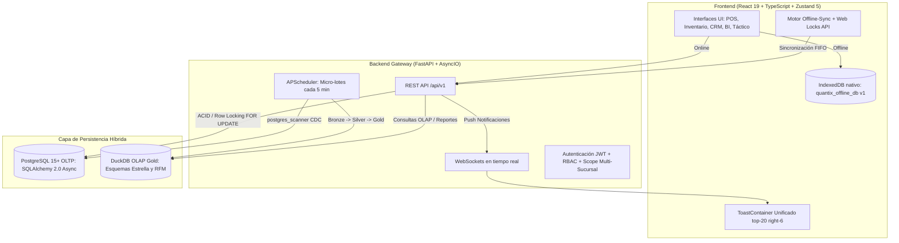

# 🚀 Quantix Retail OS — Smart POS & Business Intelligence

[](https://fastapi.tiangolo.com)
[](https://react.dev)
[](https://www.typescriptlang.org)
[](https://www.postgresql.org)
[](https://duckdb.org)
[](https://tailwindcss.com)
[](https://vitejs.dev)

**Quantix Retail OS** es un sistema operativo integral de Punto de Venta (POS), Logística de Inventario y Analítica de Negocio (BI) de última generación, diseñado bajo una arquitectura híbrida **OLTP (PostgreSQL)** + **OLAP (DuckDB Gold con Medallion Architecture)** y una filosofía **Offline-First**.

---

## 🧠 Arquitectura de la Plataforma



- **OLTP (Transaccional):** PostgreSQL 15+ administrado asíncronamente con **SQLAlchemy 2.0 Async** y **Alembic** (11 migraciones versionadas). Aplica bloqueo pesimista `SELECT ... FOR UPDATE` para checkout concurrente y despacho estricto FEFO.
- **OLAP (Analítico):** **DuckDB** como motor columnar embebido de alta velocidad sincronizado mediante un pipeline ETL Medallion (Bronze $\rightarrow$ Silver $\rightarrow$ Gold) con consultas sub-segundo sobre millones de transacciones.
- **Backend:** **FastAPI** (Python 3.11+) con inyección de dependencias, aislamiento estricto multi-sucursal por RBAC, WebSockets autenticados y servicio de correo transaccional SMTP.
- **Frontend:** **React 19**, **Vite 8**, **TypeScript**, **Tailwind CSS v4**, y **Zustand 5** con persistencia modular.
- **Offline-First:** Base de datos local **IndexedDB** (`quantix_offline_db` v1), exclusión mutua con la **Web Locks API**, cola FIFO de cobros sin red y consola administrativa de resolución de incidencias en Operaciones.

---

## ✨ Módulos y Capacidades Principales

### 1. Punto de Venta (POS) & Checkout de Alta Velocidad
- **Cobro Multimodal:** División de pagos en efectivo, tarjeta (pasarela simulada) y transferencias bancarias directas (código QR DeUna Banco Pichincha 25×25 SVG y Contactless).
- **Logística FEFO Estricta:** Asignación atómica de lotes por orden de caducidad descartando existencias vencidas.
- **Pesaje en Báscula:** Soporte nativo para productos a granel (`requiere_pesaje`) con cantidades `Numeric(10,3)`.
- **Integridad y Resiliencia:** Idempotencia mediante encabezados `idempotency_key`, anulación de tickets con reversión de inventario y envío de comprobante digital por correo electrónico.

### 2. Control de Caja, Arqueos y Auditoría Antifraude
- **Arqueo Ciego:** El cajero declara valores reales sin conocer el saldo teórico del sistema.
- **Movimientos de Caja:** Registro de ingresos y egresos de efectivo fuera de venta con motivo tipificado y auditoría.
- **Cierres Fiscales:** Generación formal de reportes de **Corte X** (parcial) y **Corte Z** (cierre definitivo con bloqueo de sesión).
- **Métricas de Control:** Cálculo de tasa de precisión de gaveta (`precision_gaveta_pct`) y alertas de descuadre crítico ($50) difundidas por WebSockets y correo.

### 3. Inventario, Trazabilidad y Recepción Parcial
- **Clasificación ABC:** Segmentación de catálogo según Pareto (80-15-5).
- **Órdenes de Compra y Recepción Parcial:** Estados `EMITIDA`, `RECIBIDA_PARCIAL` y `RECIBIDA` con generación de lotes sanitarios con prefijo `SAN-`.
- **Pronóstico de Demanda:** Cálculo de punto de reorden dinámico según velocidad de consumo a 30 días, lead time del proveedor y stock de seguridad por clase ABC.

### 4. Logística de Transferencias Multi-Sede
- **Ciclo Custodiado:** Solicitud, despacho en origen, tránsito y recepción física en destino con generación de lotes de transferencia `TR-`.
- **Reversibilidad:** Reversión atómica de existencias si una transferencia en tránsito es cancelada.
- **Vistas Operativas:** Modales dedicados `TransferenciaModal` y `TransferenciaDetalleModal`.

### 5. Arquitectura Multi-Sucursal y Seguridad RBAC
- **Aislamiento Territorial Estricto:** Rol `SUPERVISOR` restringido a su sede asignada con respuesta HTTP 403 Forbidden ante accesos cruzados; rol `DIRECTOR` con acceso corporativo global.
- **Sincronización Reactiva en UI:** `useSucursalStore` propaga el cambio de sede a todas las vistas operativas y analíticas de forma instantánea.
- **Gestión de Terminales:** Registro de terminales físicos y cajas vinculadas a cada sucursal.

### 6. CRM, Programa de Lealtad y Promociones
- **Cédula de Identidad Única:** Campo indexado `cedula` validado mediante el algoritmo matemático oficial de **Módulo 10**.
- **Monedero de Puntos:** Acumulación y canje transparente de puntos de fidelización (10 pts = $1).
- **Cupones Territoriales:** Cupones con alcance multi-sucursal y control de estados `EMITIDO`, `CANJEADO`, `EXPIRADO`.
- **Segmentación RFM:** Clasificación dinámica en 9 cuadrantes en DuckDB Gold (Campeones, Leales, En Riesgo, etc.).
- **Motor de Promociones:** Reglas comerciales automáticas (`COMBO`, `VOLUMEN`, `MONTO_MINIMO`) con salvaguarda de margen bruto.

### 7. Analítica BI, DuckDB Gold & Diseñador OLAP
- **Tableros Gerenciales:** Indicadores ejecutivos en tiempo real graficados con Recharts (curvas de venta, distribución por sucursal, mapa de calor $7 \times 24$).
- **Constructor de Reportes Personalizados:** Diseñador OLAP en `Analisis.tsx` con catálogo de 15 dimensiones y hechos, reordenamiento dinámico, agregaciones (`SUM`, `AVG`, `COUNT`), fila fija de totales y persistencia de plantillas en base de datos (`plantillas_reporte`).
- **Exportación:** Generación de archivos CSV con BOM UTF-8 y documentos PDF para impresión formal.

### 8. Validación de Formularios y Notificaciones Unificadas
- **Validaciones Centralizadas:** Algoritmo Módulo 10 para Cédula y RUC, validación de código de barras EAN-13, medidor de entropía de contraseñas y hook `useFormValidation.ts` con autoenfoque accesible.
- **Sistema de Toasts Unificado:** Contenedor único flotante `ToastContainer.tsx` posicionado en `fixed top-20 right-6 z-50` con 4 niveles de severidad (`CRITICO`, `WARNING`, `SUCCESS`, `INFO`) y soporte para pausas en hover.

---

## 📁 Estructura del Repositorio

```text
Quantix/
├── backend/                             # API FastAPI y Motor Analítico
│   ├── alembic/                         # 11 migraciones versionadas (0001 a 0011)
│   ├── app/
│   │   ├── api/                         # Endpoints REST (auth, ventas, inventario, caja, etc.)
│   │   ├── core/                        # Configuración, JWT, seguridad y base de datos
│   │   ├── etl/                         # Pipeline Medallion (PostgreSQL -> DuckDB Gold)
│   │   ├── models/                      # Modelos declarativos SQLAlchemy 2.0
│   │   ├── schemas/                     # Esquemas de validación Pydantic v2
│   │   └── seed.py                      # Semilla de datos de prueba
│   └── tests/                           # Suite de pruebas Pytest
│
├── frontend/                            # Aplicación SPA React 19
│   ├── src/
│   │   ├── components/                  # Componentes reutilizables, modales y ToastContainer
│   │   ├── hooks/                       # Custom hooks (useFormValidation, useToast, etc.)
│   │   ├── pages/                       # Vistas principales (POS, Inventario, Clientes, Analisis, etc.)
│   │   ├── services/                    # Clientes API HTTP y motor de IndexedDB offline
│   │   ├── store/                       # Stores de Zustand (auth, sucursal, cart, notification)
│   │   └── utils/                       # Validaciones matemáticas (Módulo 10, EAN-13)
│   └── package.json
│
├── specs/                               # 16 Especificaciones Técnicas Estandarizadas
│   ├── 001-core-ventas-inventario/      # POS, checkout multimodal, balanza y FEFO
│   ├── 002-clientes-fidelizacion/       # Cédula, lealtad por puntos, cupones y RFM
│   ├── 003-precios-margenes/            # Curva Pareto ABC y recepción parcial
│   ├── 004-pronostico-demanda/          # Reorden por velocidad y distribución Normal Z
│   ├── 005-promociones-inteligentes/    # Motor de promociones y combos
│   ├── 006-caja-mermas-fraude/          # Movimientos de caja, Corte X y Corte Z
│   ├── 007-pagos-seguridad/             # Pasarela simulada y Contactless/QR DeUna
│   ├── 008-offline-sync/                # IndexedDB y resolución de conflictos
│   ├── 009-etl-medallion/               # Orquestador APScheduler y DuckDB Gold
│   ├── 010-auth-usuarios/               # RBAC (4 roles) y aislamiento territorial
│   ├── 011-tableros-bi/                 # Telemetría estratégica y Recharts
│   ├── 012-notificaciones/             # Arquitectura de Toasts y WebSockets
│   ├── 013-multi-sucursal/              # Terminales y sincronización global
│   ├── 014-reportes-olap-personalizados/# Constructor OLAP y plantillas relacionales
│   ├── 015-transferencias-stock-multisede/# Logística inter-sucursal y lotes TR-
│   └── 016-validacion-sanitizacion-formularios/ # Algoritmo Módulo 10 y validaciones EAN
│
└── docs/                                # Documentación Formal del Sistema
    ├── arquitectura/                    # Arquitectura técnica, DDL y pipeline Medallion
    ├── requisitos/                      # SRS v2.0, análisis de cobertura y gap analysis
    ├── negocio/                         # Modelo comercial y pirámide organizacional
    └── diseño/                          # 28 Prototipos HTML interactivos (Neo-Retail)
```

---

## 🛠️ Requisitos del Entorno

1. **Docker & Docker Compose** (para ejecutar el servicio de PostgreSQL).
2. **Node.js** (v18 o superior) y **npm**.
3. **Python** (v3.11 o v3.12 recomendado).

---

## 🚀 Guía de Puesta en Marcha Rápida

### 1. Levantar el Contenedor de Base de Datos
```powershell
# Asegúrate de que Docker Desktop esté encendido
docker-compose up -d
```

### 2. Configuración y Ejecución del Backend
```powershell
cd backend

# Crear y activar entorno virtual
python -m venv venv
.\venv\Scripts\Activate.ps1

# Instalar dependencias
pip install -r requirements.txt

# Aplicar las 11 migraciones de base de datos
alembic upgrade head

# Inyectar datos semilla (usuarios, sucursales, productos y lotes)
python -m app.seed

# Iniciar servidor FastAPI
uvicorn app.main:app --reload
```
📍 *Servidor Backend activo en: [http://localhost:8000](http://localhost:8000)*  
📍 *Documentación interactiva OpenAPI (Swagger): [http://localhost:8000/docs](http://localhost:8000/docs)*

### 3. Configuración y Ejecución del Frontend
En una nueva terminal:
```powershell
cd frontend

# Instalar dependencias
npm install

# Iniciar servidor de desarrollo Vite
npm run dev
```
📍 *Aplicación Web activa en: [http://localhost:5173](http://localhost:5173)*

---

## 🔑 Credenciales por Defecto (Datos Semilla)

Al ejecutar `python -m app.seed`, se configuran las siguientes cuentas con sus roles y niveles de acceso:

| Rol | Correo Electrónico | Contraseña | Alcance Territorial | Vistas Asignadas |
| :--- | :--- | :--- | :--- | :--- |
| **Director** | `admin@quantix.local` | `Admin123!` | Global (Todas las sucursales) | Dashboard BI, Táctico, Inventario, Clientes, Operaciones, POS |
| **Supervisor** | `supervisor@quantix.local` | `Super123!` | Sucursal Asignada (HTTP 403 en otras) | Monitor Táctico, Cajas, Arqueos, Auditoría, POS |
| **Bodeguero** | `bodeguero@quantix.local` | `Bodega123!` | Sucursal Asignada | Inventario, Recepción de Mercancía, Lotes FEFO |
| **Cajero** | `cajero@quantix.local` | `Caja123!` | Terminal Asignada | POS, Cobro, Apertura y Arqueo Ciego |

---

## 🧪 Ejecución de Pruebas y Validación

```powershell
# 1. Pruebas Unitarias y de Integración Frontend (Vitest)
cd frontend
npm test -- --run

# 2. Compilación y Chequeo de Tipos en Frontend
npm run build

# 3. Pruebas Backend (Pytest)
cd ../backend
python -m pytest tests -q
```

---

## 📜 Licencia & Créditos

Desarrollado como plataforma integral de alta concurrencia para retail por el equipo de **Quantix**.
Arquitectura y especificaciones técnicas auditadas bajo el estándar **Neo-Retail Industrial Minimalism**.
