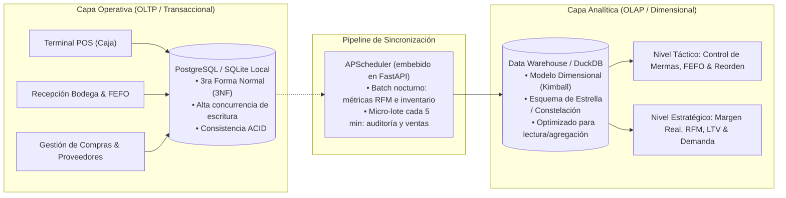
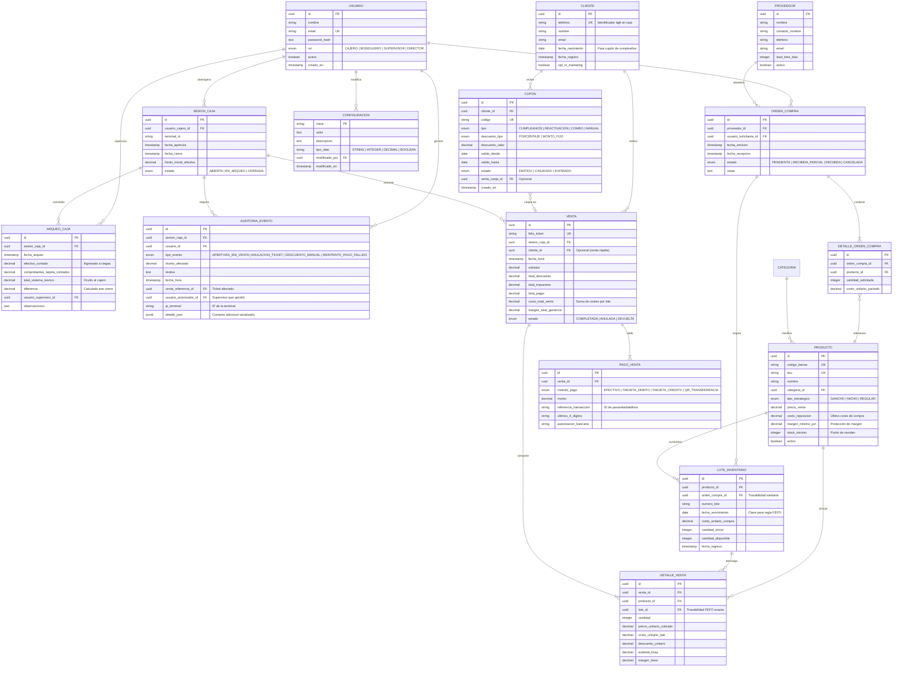

# Diseño Arquitectónico: Modelos de Datos de Quantix

Este documento define la arquitectura de datos de **Quantix**, desglosada en dos capas complementarias y desacopladas:
1. **Capa Operativa (OLTP):** Modelo relacional normalizado (3NF), optimizado para velocidad sub-segundo en caja (POS), integridad referencial estricta, soporte offline-first y control de fraude/mermas.
2. **Capa Analítica (OLAP / Táctica y Estratégica):** Modelo dimensional (Esquema Estrella / Constelación de Kimball), optimizado para agregaciones masivas, cálculo de márgenes en tiempo real, segmentación RFM/LTV y proyecciones de demanda.

---

## 1. Visión General del Flujo de Datos



---

## 2. Capa Operativa (OLTP): Modelo Relacional

### 2.1 Diagrama Entidad-Relación (ERD)




### 2.2 DDL Completo — Capa OLTP

#### Enumeraciones

```sql
CREATE TYPE rol_usuario_enum       AS ENUM ('CAJERO','BODEGUERO','SUPERVISOR','DIRECTOR');
CREATE TYPE estado_sesion_enum     AS ENUM ('ABIERTA','EN_ARQUEO','CERRADA');
CREATE TYPE tipo_estrategico_enum  AS ENUM ('GANCHO','NICHO','REGULAR');
CREATE TYPE metodo_pago_enum       AS ENUM ('EFECTIVO','TARJETA_DEBITO','TARJETA_CREDITO','QR_TRANSFERENCIA');
CREATE TYPE estado_venta_enum      AS ENUM ('COMPLETADA','ANULADA','DEVUELTA');
CREATE TYPE tipo_evento_enum       AS ENUM ('APERTURA_SIN_VENTA','ANULACION_TICKET','DESCUENTO_MANUAL','REINTENTO_PAGO_FALLIDO');
CREATE TYPE estado_orden_enum      AS ENUM ('PENDIENTE','RECIBIDA_PARCIAL','RECIBIDA','CANCELADA');
CREATE TYPE tipo_cupon_enum        AS ENUM ('CUMPLEANIOS','REACTIVACION','COMBO','MANUAL');
CREATE TYPE descuento_tipo_enum    AS ENUM ('PORCENTAJE','MONTO_FIJO');
CREATE TYPE estado_cupon_enum      AS ENUM ('EMITIDO','CANJEADO','EXPIRADO');
```

#### Tabla `usuario`

```sql
CREATE TABLE usuario (
    id            UUID PRIMARY KEY DEFAULT gen_random_uuid(),
    nombre        VARCHAR(100) NOT NULL,
    email         VARCHAR(150) NOT NULL UNIQUE,
    password_hash TEXT NOT NULL,
    rol           rol_usuario_enum NOT NULL,
    activo        BOOLEAN NOT NULL DEFAULT TRUE,
    creado_en     TIMESTAMP WITH TIME ZONE DEFAULT CURRENT_TIMESTAMP
);
CREATE INDEX idx_usuario_email ON usuario(email);
```

#### Tabla `proveedor`

```sql
CREATE TABLE proveedor (
    id              UUID PRIMARY KEY DEFAULT gen_random_uuid(),
    nombre          VARCHAR(150) NOT NULL,
    contacto_nombre VARCHAR(100),
    telefono        VARCHAR(30),
    email           VARCHAR(150),
    lead_time_dias  INTEGER NOT NULL DEFAULT 7,
    activo          BOOLEAN NOT NULL DEFAULT TRUE
);
```

#### Tablas `orden_compra` y `detalle_orden_compra`

```sql
CREATE TABLE orden_compra (
    id                     UUID PRIMARY KEY DEFAULT gen_random_uuid(),
    proveedor_id           UUID NOT NULL REFERENCES proveedor(id),
    usuario_solicitante_id UUID NOT NULL REFERENCES usuario(id),
    fecha_emision          TIMESTAMP WITH TIME ZONE DEFAULT CURRENT_TIMESTAMP,
    fecha_recepcion        TIMESTAMP WITH TIME ZONE,
    estado                 estado_orden_enum NOT NULL DEFAULT 'PENDIENTE',
    notas                  TEXT
);

CREATE TABLE detalle_orden_compra (
    id                     UUID PRIMARY KEY DEFAULT gen_random_uuid(),
    orden_compra_id        UUID NOT NULL REFERENCES orden_compra(id) ON DELETE CASCADE,
    producto_id            UUID NOT NULL REFERENCES productos(id),
    cantidad_solicitada    INTEGER NOT NULL CHECK (cantidad_solicitada > 0),
    costo_unitario_pactado NUMERIC(10,2) NOT NULL CHECK (costo_unitario_pactado >= 0)
);
```

#### Tabla `cupon`

```sql
CREATE TABLE cupon (
    id              UUID PRIMARY KEY DEFAULT gen_random_uuid(),
    cliente_id      UUID NOT NULL REFERENCES cliente(id) ON DELETE CASCADE,
    codigo          VARCHAR(20) NOT NULL UNIQUE,
    tipo            tipo_cupon_enum NOT NULL,
    descuento_tipo  descuento_tipo_enum NOT NULL,
    descuento_valor NUMERIC(10,2) NOT NULL CHECK (descuento_valor > 0),
    valido_desde    DATE NOT NULL,
    valido_hasta    DATE NOT NULL,
    estado          estado_cupon_enum NOT NULL DEFAULT 'EMITIDO',
    venta_canje_id  UUID REFERENCES ventas(id),
    creado_en       TIMESTAMP WITH TIME ZONE DEFAULT CURRENT_TIMESTAMP
);
CREATE INDEX idx_cupon_codigo  ON cupon(codigo);
CREATE INDEX idx_cupon_cliente ON cupon(cliente_id, estado);
```

#### Tabla `configuracion`

```sql
CREATE TABLE configuracion (
    clave          VARCHAR(100) PRIMARY KEY,
    valor          TEXT NOT NULL,
    descripcion    TEXT,
    tipo_dato      VARCHAR(20) NOT NULL DEFAULT 'STRING', -- STRING, INTEGER, DECIMAL, BOOLEAN
    modificado_por UUID REFERENCES usuario(id),
    modificado_en  TIMESTAMP WITH TIME ZONE DEFAULT CURRENT_TIMESTAMP
);

-- Valores iniciales de referencia
INSERT INTO configuracion(clave, valor, descripcion, tipo_dato) VALUES
  ('fefo_alerta_dias_1',         '15',   'Primer umbral de alerta de caducidad en días',                    'INTEGER'),
  ('fefo_alerta_dias_2',         '30',   'Segundo umbral de alerta de caducidad en días',                   'INTEGER'),
  ('fefo_alerta_dias_3',         '45',   'Tercer umbral de alerta de caducidad en días',                    'INTEGER'),
  ('caja_tolerancia_descuadre',  '5.00', 'Tolerancia máxima en moneda antes de alertar por descuadre',     'DECIMAL'),
  ('rfm_multiplo_reactivacion',  '1.5',  'Multiplicador sobre ciclo intercompra para disparar reactivación','DECIMAL'),
  ('inventario_dias_sobrestock', '90',   'Días sin rotación para clasificar como sobrestock',               'INTEGER');
```

#### Modificación a `lote_inventario` — FK a `orden_compra`

```sql
ALTER TABLE lote_inventario
    ADD COLUMN orden_compra_id UUID REFERENCES orden_compra(id); -- Trazabilidad sanitaria
```

#### Modificación a `auditoria_evento` — Contexto forense

```sql
ALTER TABLE auditoria_evento
    ADD COLUMN venta_referencia_id    UUID REFERENCES ventas(id),   -- Ticket afectado
    ADD COLUMN usuario_autorizador_id UUID REFERENCES usuario(id),  -- Supervisor que aprobó
    ADD COLUMN ip_terminal            VARCHAR(50),                   -- IP de la terminal
    ADD COLUMN detalle_json           JSONB;                         -- Contexto adicional serializado
```

### 2.3 Decisiones Clave del Modelo Operativo

1. **Captura Rápida en Caja sin Fricción:**
   * La tabla `CLIENTE` tiene `telefono` como índice único principal de búsqueda. En el terminal POS, el cajero digita solo el teléfono (3 segundos). Si el cliente no existe o prefiere anonimato, `VENTA.cliente_id` es `NULL` para no demorar la transacción.
2. **Control FEFO Estricto a Nivel de Detalle:**
   * `DETALLE_VENTA` almacena tanto el `producto_id` como el `lote_id` de donde se extrajo la unidad. El sistema sugiere por defecto el lote con `fecha_vencimiento` más cercana (**FEFO**).
   * Al registrar `costo_unitario_lote` en la misma fila de la venta, el margen unitario queda congelado en el tiempo, inmune a futuros cambios de coste.
3. **Mecanismo de Arqueo Ciego contra Robo Hormiga:**
   * En `ARQUEO_CAJA`, los campos `efectivo_contado` y `comprobantes_tarjeta_contados` son los únicos que el cajero rellena.
   * El sistema calcula `total_sistema_teorico` y la `diferencia` solo tras el envío del formulario, registrando inmediatamente cualquier faltante/sobrante y alertando al supervisor.
4. **Log de Auditoría Inmutable con Contexto Forense:**
   * La tabla `AUDITORIA_EVENTO` solo admite inserciones (`APPEND-ONLY`). Cada vez que un cajero abre el cajón portamonedas sin registrar venta o aplica un descuento manual, se genera un registro firmado con timestamp, IP de terminal, referencia al ticket afectado y el supervisor autorizador.
5. **Trazabilidad Sanitaria de Lotes:**
   * El campo `orden_compra_id` en `LOTE_INVENTARIO` permite rastrear de qué orden de compra proviene cada lote, habilitando retiros sanitarios selectivos sin afectar al resto del inventario.
6. **Cupones Parametrizados:**
   * La tabla `CUPON` soporta los flujos de fidelización de cumpleaños, reactivación de clientes dormidos y combos promocionales, con doble indexación por código (búsqueda rápida en caja) y por estado del cliente.
7. **Configuración Centralizada:**
   * `CONFIGURACION` elimina constantes dispersas en el código. Los umbrales FEFO, tolerancias de arqueo y multiplicadores RFM se gestionan en base de datos y son modificables por un Supervisor/Director sin redespliegue.

---

## 3. Capa Analítica (OLAP): Modelo Dimensional de Kimball

Para responder a las necesidades del **Nivel Táctico (MIS/DSS)** y del **Nivel Estratégico (EIS/BI)**, se define un esquema de **Constelación de Hechos (Fact Constellation)** con dimensiones compartidas (*conformed dimensions*).

### 3.1 Diagrama del Esquema Dimensional

```mermaid
erDiagram
    DIM_TIEMPO ||--o{ FACT_VENTAS : fecha
    DIM_PRODUCTO ||--o{ FACT_VENTAS : producto
    DIM_CLIENTE ||--o{ FACT_VENTAS : cliente
    DIM_SUCURSAL_CAJA ||--o{ FACT_VENTAS : terminal
    DIM_METODO_PAGO ||--o{ FACT_VENTAS : metodo

    DIM_TIEMPO ||--o{ FACT_INVENTARIO_DIARIO : fecha
    DIM_PRODUCTO ||--o{ FACT_INVENTARIO_DIARIO : producto
    DIM_SUCURSAL_CAJA ||--o{ FACT_INVENTARIO_DIARIO : sucursal

    DIM_TIEMPO ||--o{ FACT_ARQUEOS_MERMA : fecha
    DIM_SUCURSAL_CAJA ||--o{ FACT_ARQUEOS_MERMA : terminal
    DIM_EMPLEADO ||--o{ FACT_ARQUEOS_MERMA : cajero

    DIM_TIEMPO ||--o{ FACT_TICKETS : fecha
    DIM_SUCURSAL_CAJA ||--o{ FACT_TICKETS : terminal
    DIM_CLIENTE ||--o{ FACT_TICKETS : cliente
    DIM_METODO_PAGO ||--o{ FACT_TICKETS : metodo

    DIM_TIEMPO ||--o{ FACT_COMPRAS : fecha
    DIM_PROVEEDOR ||--o{ FACT_COMPRAS : proveedor
    DIM_PRODUCTO ||--o{ FACT_COMPRAS : producto
    DIM_SUCURSAL_CAJA ||--o{ FACT_COMPRAS : sucursal

    DIM_TIEMPO ||--o{ FACT_DEVOLUCIONES : fecha
    DIM_PRODUCTO ||--o{ FACT_DEVOLUCIONES : producto
    DIM_CLIENTE ||--o{ FACT_DEVOLUCIONES : cliente
    DIM_SUCURSAL_CAJA ||--o{ FACT_DEVOLUCIONES : sucursal

    DIM_CLIENTE ||--o{ FACT_CLIENTE_RFM_PERIODO : cliente
    DIM_TIEMPO ||--o{ FACT_CLIENTE_RFM_PERIODO : periodo

    FACT_VENTAS {
        bigint tiempo_key FK
        bigint producto_key FK
        bigint cliente_key FK
        bigint sucursal_caja_key FK
        bigint metodo_pago_key FK
        string folio_ticket
        integer cantidad_vendida
        decimal venta_bruta
        decimal descuento_aplicado
        decimal venta_neta
        decimal costo_mercancia_vendida "COGS"
        decimal margen_bruto_moneda
        decimal margen_bruto_pct
        boolean es_producto_gancho
    }

    FACT_TICKETS {
        bigint tiempo_key FK
        bigint sucursal_caja_key FK
        bigint cliente_key FK
        bigint metodo_pago_key FK
        string folio_ticket
        integer total_lineas_detalle
        decimal subtotal
        decimal total_descuento
        decimal total_pagar
        decimal costo_total
        decimal margen_ticket
        boolean tiene_producto_gancho
        boolean tiene_producto_nicho
        boolean fue_anulado
    }

    FACT_COMPRAS {
        bigint tiempo_key FK
        bigint proveedor_key FK
        bigint producto_key FK
        bigint sucursal_caja_key FK
        string orden_compra_id
        integer cantidad_recibida
        decimal costo_unitario_pactado
        decimal costo_total_compra
        integer lead_time_real_dias "Diferencia entre emision y recepcion"
        decimal margen_impacto_pct "Como afecto al margen del producto"
    }

    FACT_DEVOLUCIONES {
        bigint tiempo_key FK
        bigint producto_key FK
        bigint cliente_key FK
        bigint sucursal_caja_key FK
        string venta_original_folio
        integer cantidad_devuelta
        decimal valor_devuelto
        decimal costo_reintegrado
        decimal margen_perdido "Margen que se revirtio"
        string motivo
    }

    FACT_CLIENTE_RFM_PERIODO {
        bigint cliente_key FK
        bigint periodo_key FK
        string segmento_rfm "CAMPEON | LEAL | EN_RIESGO | DORMIDO"
        integer score_recencia "1 a 5"
        integer score_frecuencia "1 a 5"
        integer score_monetario "1 a 5"
        integer dias_ciclo_promedio "Ciclo habitual de recompra"
        decimal ltv_acumulado "Customer Lifetime Value"
        integer dias_desde_ultima_compra
    }

    DIM_PRODUCTO {
        bigint producto_key PK
        uuid producto_id_oltp
        string sku
        string nombre
        string categoria
        string tipo_estrategico "GANCHO | NICHO | REGULAR"
        decimal margen_objetivo_pct
        date fecha_inicio_vigencia "SCD Tipo 2"
        date fecha_fin_vigencia
        boolean es_actual
    }

    DIM_CLIENTE {
        bigint cliente_key PK
        uuid cliente_id_oltp
        string nombre
        string email
        string telefono
        string ciudad
        date fecha_registro
        string canal_captacion
    }

    DIM_PROVEEDOR {
        bigint proveedor_key PK
        uuid proveedor_id_oltp
        string nombre
        integer lead_time_promedio_dias
        string ciudad
        boolean es_activo
    }

    DIM_TIEMPO {
        bigint tiempo_key PK
        date fecha
        integer anio
        integer mes
        string nombre_mes
        integer semana_anio
        integer dia_semana
        boolean es_fin_de_semana
        boolean es_festivo
        string temporada "NAVIDAD | VERANO | REGULAR"
    }

    DIM_SUCURSAL_CAJA {
        bigint sucursal_caja_key PK
        string sucursal_nombre
        string ciudad
        string terminal_id
    }

    DIM_EMPLEADO {
        bigint empleado_key PK
        uuid usuario_id_oltp
        string nombre_completo
        string rol "CAJERO | SUPERVISOR"
        date fecha_ingreso
    }

    DIM_METODO_PAGO {
        bigint metodo_pago_key PK
        string medio "EFECTIVO | TARJETA | BILLETERA_DIGITAL"
        string pasarela "STRIPE | REDSYS | MERCADOPAGO | LOCAL"
        decimal comision_pct_estimada
    }

    FACT_INVENTARIO_DIARIO {
        bigint tiempo_key FK
        bigint producto_key FK
        bigint sucursal_caja_key FK
        integer stock_disponible
        integer stock_proximo_vencer_15d "Alerta FEFO táctica"
        decimal valor_inventario_costo "Capital inmovilizado"
        decimal dias_inventario_proyectados "Días de cobertura"
        integer cantidad_rotura_stock "Ventas no satisfechas"
    }

    FACT_ARQUEOS_MERMA {
        bigint tiempo_key FK
        bigint sucursal_caja_key FK
        bigint empleado_cajero_key FK
        decimal total_ventas_sesion
        decimal monto_diferencia_arqueo "Faltante o sobrante"
        integer cantidad_anulaciones
        decimal monto_anulaciones
        integer cantidad_aperturas_sin_venta
        decimal monto_descuentos_manuales
    }
```




### 3.2 Notas sobre el Modelo Dimensional


- **`DIM_CLIENTE` vs. `FACT_CLIENTE_RFM_PERIODO`:** Los atributos de identidad estables del cliente (nombre, email, teléfono, ciudad, canal de captación) residen en `DIM_CLIENTE`. Los indicadores dinámicos de comportamiento (segmento RFM, scores, LTV, días desde última compra) se materializan mensualmente en `FACT_CLIENTE_RFM_PERIODO`, habilitando análisis de evolución de segmento en el tiempo.
- **`FACT_TICKETS`** opera a grano grueso (1 fila = 1 ticket completo), complementando a `FACT_VENTAS` (grano fino, 1 fila = 1 línea de producto) para consultas de ticket medio, mezcla de producto gancho/nicho por ticket y análisis de anulaciones.
- **`FACT_COMPRAS`** cierra el ciclo de margen al vincular el coste pactado con el proveedor directamente con el producto en el tiempo, permitiendo calcular el impacto en margen ante variaciones de precio de compra.
- **`FACT_DEVOLUCIONES`** cuantifica el margen revertido por devolución, clave para detectar abuso o patrones de fraude en devoluciones.
- **`DIM_PROVEEDOR`** es una dimensión conformada compartida por `FACT_COMPRAS`.

---

## 4. Consultas y Métricas Soportadas por Capa

### 4.1 Nivel Táctico (MIS / DSS)

#### Caso Táctico 1: Prevención de Mermas por Caducidad (FEFO)
* **Objetivo:** Listar lotes de productos con vencimiento en menos de 15 días para aplicar rebajas o exhibición prioritaria.
```sql
SELECT 
    p.nombre,
    p.categoria,
    f.stock_proximo_vencer_15d,
    f.valor_inventario_costo
FROM FACT_INVENTARIO_DIARIO f
JOIN DIM_PRODUCTO p ON f.producto_key = p.producto_key
JOIN DIM_TIEMPO t ON f.tiempo_key = t.tiempo_key
WHERE t.fecha = CURRENT_DATE
  AND f.stock_proximo_vencer_15d > 0
ORDER BY f.valor_inventario_costo DESC;
```

#### Caso Táctico 2: Detección de Faltantes y Patrones de Robo Hormiga
* **Objetivo:** Identificar cajeros o terminales con diferencias de caja recurrentes o anomalías en aperturas sin venta.
```sql
SELECT 
    e.nombre_completo AS cajero,
    COUNT(f.tiempo_key) AS total_sesiones,
    SUM(f.monto_diferencia_arqueo) AS descuadre_acumulado,
    SUM(f.cantidad_aperturas_sin_venta) AS total_aperturas_sin_ticket,
    SUM(f.monto_descuentos_manuales) AS descuentos_otorgados
FROM FACT_ARQUEOS_MERMA f
JOIN DIM_EMPLEADO e ON f.empleado_cajero_key = e.empleado_key
JOIN DIM_TIEMPO t ON f.tiempo_key = t.tiempo_key
WHERE t.fecha >= CURRENT_DATE - INTERVAL '30 days'
GROUP BY e.nombre_completo
HAVING SUM(f.monto_diferencia_arqueo) < -50.00 
    OR SUM(f.cantidad_aperturas_sin_venta) > 10
ORDER BY descuadre_acumulado ASC;
```

---

### 4.2 Nivel Estratégico (EIS / BI)

#### Caso Estratégico 1: Matriz Margen vs. Rotación (*Loss Leader* vs. Nicho)
* **Objetivo:** Evaluar si los productos "gancho" atraen tráfico y si los clientes efectivamente compran productos de nicho de alto margen en el mismo ticket.
```sql
SELECT 
    p.tipo_estrategico,
    COUNT(DISTINCT f.folio_ticket) AS tickets_involucrados,
    SUM(f.cantidad_vendida) AS unidades_totales,
    SUM(f.venta_neta) AS facturacion_total,
    SUM(f.margen_bruto_moneda) AS beneficio_bruto,
    ROUND(SUM(f.margen_bruto_moneda) / NULLIF(SUM(f.venta_neta), 0) * 100, 2) AS margen_promedio_pct
FROM FACT_VENTAS f
JOIN DIM_PRODUCTO p ON f.producto_key = p.producto_key
JOIN DIM_TIEMPO t ON f.tiempo_key = t.tiempo_key
WHERE t.anio = 2026 AND t.mes = 9
GROUP BY p.tipo_estrategico
ORDER BY beneficio_bruto DESC;
```

#### Caso Estratégico 2: Segmentación RFM y Prevención de Abandono (*Churn*)
* **Objetivo:** Detectar clientes en riesgo cuyo tiempo sin comprar excede su ciclo habitual de consumo (evitando descuentos innecesarios a clientes con ciclos largos).
```sql
SELECT 
    c.cliente_id_oltp,
    r.segmento_rfm,
    r.dias_ciclo_promedio,
    r.dias_desde_ultima_compra,
    r.ltv_acumulado
FROM FACT_CLIENTE_RFM_PERIODO r
JOIN DIM_CLIENTE c ON r.cliente_key = c.cliente_key
JOIN DIM_TIEMPO t  ON r.periodo_key  = t.tiempo_key
WHERE t.anio = 2026 AND t.mes = 9
  AND r.dias_desde_ultima_compra > (r.dias_ciclo_promedio * 1.5)
  AND r.segmento_rfm IN ('CAMPEON', 'LEAL')
ORDER BY r.ltv_acumulado DESC;
```

---

## 5. Estrategia de Implementación y Stack Recomendado

1. **Motor Transaccional (OLTP):**
   * **PostgreSQL 16+** en servidor local/cloud.
   * **SQLite / PWA Cache** en el cliente de caja para soporte *Offline-First* con sincronización bidireccional basada en marcas de agua (*watermarks*) y UUIDs.
2. **Motor Analítico (OLAP):**
   * **ClickHouse** o **DuckDB** para analítica columnar de alta velocidad sobre los hechos agregados, embebido o en nodo de reportería.
3. **Pipeline de Ingesta (ETL):**
   * **APScheduler embebido en FastAPI** como mecanismo único de ETL para esta fase. Dos modos de ejecución:
     - **Batch nocturno** (p. ej. `cron: 0 2 * * *`): recalcula métricas RFM, snapshot de inventario diario y actualización de `FACT_CLIENTE_RFM_PERIODO`.
     - **Micro-lote cada 5 minutos** (`interval: 300s`): sincroniza `FACT_VENTAS`, `FACT_ARQUEOS_MERMA` y `FACT_TICKETS` para auditoría de caja en cuasi-tiempo-real.
   * Los jobs se registran al arrancar la aplicación FastAPI y son observables mediante el endpoint `/admin/scheduler/status`.
