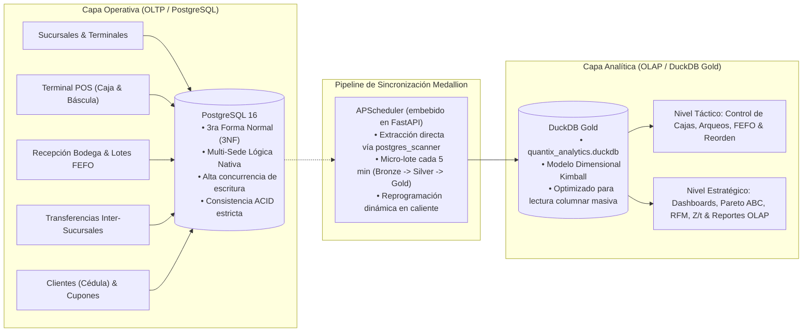

# Diseño Arquitectónico: Modelos de Datos de Quantix

Este documento define la arquitectura de datos de **Quantix**, desglosada en dos capas complementarias y desacopladas:
1. **Capa Operativa (OLTP):** Modelo relacional normalizado (3NF) en PostgreSQL, optimizado para velocidad sub-segundo en caja (POS), integridad referencial estricta, arquitectura multi-sucursal nativa, soporte offline-first y control de fraude/mermas.
2. **Capa Analítica (OLAP / Táctica y Estratégica):** Modelo dimensional (Esquema Estrella / Constelación de Kimball) en DuckDB Gold, optimizado para agregaciones masivas, cálculo de márgenes en tiempo real, segmentación RFM/LTV, proyecciones de demanda y constructor dinámico de reportes.

---

## 1. Visión General del Flujo de Datos



---

## 2. Capa Operativa (OLTP): Modelo Relacional

### 2.1 Diagrama Entidad-Relación (ERD)

```mermaid
erDiagram
    SUCURSAL ||--o{ TERMINAL_CAJA : "aloja"
    SUCURSAL ||--o{ USUARIO : "adscribe"
    SUCURSAL ||--o{ LOTE_INVENTARIO : "custodia"
    SUCURSAL ||--o{ SESION_CAJA : "opera"
    SUCURSAL ||--o{ VENTA : "factura"
    SUCURSAL ||--o{ CLIENTE : "registra"
    SUCURSAL ||--o{ CUPON : "emite"
    SUCURSAL ||--o{ PLANTILLA_REPORTE : "restringe"
    SUCURSAL ||--o{ TRANSFERENCIA_INVENTARIO : "origen/destino"

    USUARIO ||--o{ SESION_CAJA : "abre/opera"
    USUARIO ||--o{ ARQUEO_CAJA : "supervisa"
    USUARIO ||--o{ MOVIMIENTO_CAJA : "registra"
    USUARIO ||--o{ AUDITORIA_EVENTO : "genera"
    USUARIO ||--o{ ORDEN_COMPRA : "solicita"
    USUARIO ||--o{ PLANTILLA_REPORTE : "crea"

    PROVEEDOR ||--o{ ORDEN_COMPRA : "abastece"
    ORDEN_COMPRA ||--|{ DETALLE_ORDEN_COMPRA : "contiene"
    ORDEN_COMPRA ||--o{ LOTE_INVENTARIO : "origina"
    DETALLE_ORDEN_COMPRA }o--|| PRODUCTO : "solicita"

    CATEGORIA ||--o{ PRODUCTO : "clasifica"
    PRODUCTO ||--o{ LOTE_INVENTARIO : "almacena"
    PRODUCTO ||--o{ DETALLE_VENTA : "incluye"
    PRODUCTO ||--o{ DETALLE_TRANSFERENCIA : "transfiere"
    LOTE_INVENTARIO ||--o{ DETALLE_VENTA : "descarga FEFO"
    LOTE_INVENTARIO ||--o{ DETALLE_TRANSFERENCIA : "despacha"

    CLIENTE ||--o{ VENTA : "asocia"
    CLIENTE ||--o{ CUPON : "recibe"
    CUPON }o--o| VENTA : "aplica en"

    SESION_CAJA ||--o{ VENTA : "procesa"
    SESION_CAJA ||--o{ ARQUEO_CAJA : "cuadra"
    SESION_CAJA ||--o{ MOVIMIENTO_CAJA : "balancea"
    SESION_CAJA ||--o{ VENTA_OFFLINE_RECIBIDA : "recibe sync"

    VENTA ||--|{ DETALLE_VENTA : "compone"
    VENTA ||--|{ PAGO_VENTA : "salda"

    TRANSFERENCIA_INVENTARIO ||--|{ DETALLE_TRANSFERENCIA : "detalla"
    VENTA_OFFLINE_RECIBIDA ||--o{ INCIDENCIA_SYNC : "reporta quiebre"

    SUCURSAL {
        uuid id PK
        string codigo UK
        string nombre
        string ciudad
        boolean es_matriz
        boolean activo
    }

    USUARIO {
        uuid id PK
        string nombre_completo
        string email UK
        text hashed_password
        string telefono
        enum rol "DIRECTOR | SUPERVISOR | CAJERO | BODEGUERO"
        uuid sucursal_id FK
        boolean activo
    }

    CLIENTE {
        uuid id PK
        string cedula UK "Identificador ágil o RUC"
        string telefono UK "Identificador alternativo"
        string nombre
        string email
        integer puntos_acumulados "Lealtad"
        uuid sucursal_id FK
        boolean activo
    }

    PRODUCTO {
        uuid id PK
        string codigo_barras UK
        string sku UK
        string nombre
        uuid categoria_id FK
        string clasificacion_abc "A | B | C"
        boolean requiere_pesaje "Control de báscula"
        decimal precio_venta
        decimal costo_base
        decimal margen_minimo_pct
        boolean activo
    }

    LOTE_INVENTARIO {
        uuid id PK
        uuid producto_id FK
        uuid sucursal_id FK "Aislamiento por sede"
        uuid orden_compra_id FK
        string codigo_lote "SAN-YYYYMMDD-XXXXXX"
        date fecha_vencimiento "FEFO estricto"
        decimal costo_unitario
        decimal cantidad_disponible
        enum estado "ACTIVO | AGOTADO | CADUCADO | MERMA"
    }

    SESION_CAJA {
        uuid id PK
        uuid usuario_id FK
        uuid sucursal_id FK
        string terminal_id
        decimal monto_inicial_efectivo
        timestamp fecha_inicio
        timestamp fecha_cierre
        enum estado "ABIERTA | CERRADA | DESCUADRE"
    }

    MOVIMIENTO_CAJA {
        uuid id PK
        uuid sesion_id FK
        uuid usuario_id FK
        enum tipo "INGRESO | EGRESO"
        decimal monto
        string concepto "Justificación contable"
        timestamp fecha_hora
    }

    ARQUEO_CAJA {
        uuid id PK
        uuid sesion_id FK UK
        uuid cajero_id FK
        decimal total_teorico "Calculado por servidor"
        decimal total_fisico_declarado "Ciego"
        decimal diferencia
        string estado "OK | SOBRANTE | FALTANTE"
        jsonb desglose_declarado_json
    }

    VENTA {
        uuid id PK
        string folio_ticket UK
        uuid sesion_caja_id FK
        uuid sucursal_id FK
        uuid cliente_id FK
        decimal total_bruto
        decimal total_descuento
        decimal total_impuestos
        decimal total_pagar
        string idempotency_key UK
        enum estado "COMPLETADA | ANULADA | PENDIENTE_SYNC"
    }

    TRANSFERENCIA_INVENTARIO {
        uuid id PK
        string folio UK
        uuid sucursal_origen_id FK
        uuid sucursal_destino_id FK
        uuid usuario_solicitante_id FK
        enum estado "SOLICITADA | EN_TRANSITO | RECIBIDA | CANCELADA"
        timestamp fecha_solicitud
        timestamp fecha_recepcion
    }

    PLANTILLA_REPORTE {
        uuid id PK
        uuid usuario_id FK
        uuid sucursal_id FK
        string nombre
        jsonb columnas_seleccionadas
        jsonb filtros_defecto
        boolean es_publica
    }
```

---

## 2.2 DDL Completo — Capa OLTP (PostgreSQL)

```sql
-- Tipos ENUM de Base de Datos
CREATE TYPE rol_usuario_enum AS ENUM ('DIRECTOR', 'SUPERVISOR', 'CAJERO', 'BODEGUERO');
CREATE TYPE estado_sesion_caja_enum AS ENUM ('ABIERTA', 'CERRADA', 'DESCUADRE');
CREATE TYPE tipo_movimiento_caja_enum AS ENUM ('INGRESO', 'EGRESO');
CREATE TYPE estado_lote_enum AS ENUM ('ACTIVO', 'AGOTADO', 'CADUCADO', 'MERMA');
CREATE TYPE estado_venta_enum AS ENUM ('COMPLETADA', 'CANCELADA_PARCIAL', 'ANULADA', 'PENDIENTE_SYNC', 'PAGADO');
CREATE TYPE metodo_pago_enum AS ENUM ('EFECTIVO', 'TARJETA', 'TRANSFERENCIA', 'QR', 'CUPON');
CREATE TYPE estado_orden_compra_enum AS ENUM ('PENDIENTE', 'RECIBIDA_PARCIAL', 'RECIBIDA', 'CANCELADA');
CREATE TYPE tipo_cupon_enum AS ENUM ('CUMPLEANIOS', 'REACTIVACION', 'COMBO', 'MANUAL');
CREATE TYPE descuento_regla_tipo AS ENUM ('PORCENTAJE', 'MONTO_FIJO');
CREATE TYPE estado_cupon_enum AS ENUM ('EMITIDO', 'CANJEADO', 'EXPIRADO');
CREATE TYPE estado_transferencia_enum AS ENUM ('SOLICITADA', 'EN_TRANSITO', 'RECIBIDA', 'CANCELADA');

-- 1. Tabla Sucursal y Terminales (Alembic 0008)
CREATE TABLE sucursal (
    id          UUID PRIMARY KEY DEFAULT gen_random_uuid(),
    codigo      VARCHAR(20) NOT NULL UNIQUE,
    nombre      VARCHAR(150) NOT NULL,
    direccion   VARCHAR(255),
    ciudad      VARCHAR(100),
    telefono    VARCHAR(30),
    activo      BOOLEAN NOT NULL DEFAULT TRUE,
    es_matriz   BOOLEAN NOT NULL DEFAULT FALSE,
    creado_en   TIMESTAMP WITH TIME ZONE DEFAULT CURRENT_TIMESTAMP
);

CREATE TABLE terminal_caja (
    id          UUID PRIMARY KEY DEFAULT gen_random_uuid(),
    codigo      VARCHAR(50) NOT NULL,
    sucursal_id UUID NOT NULL REFERENCES sucursal(id) ON DELETE CASCADE,
    nombre      VARCHAR(100) NOT NULL,
    activa      BOOLEAN NOT NULL DEFAULT TRUE,
    creado_en   TIMESTAMP WITH TIME ZONE DEFAULT CURRENT_TIMESTAMP,
    CONSTRAINT uq_terminal_sucursal_codigo UNIQUE (sucursal_id, codigo)
);

-- 2. Tabla Usuario (Alembic 0005, 0008)
CREATE TABLE usuario (
    id              UUID PRIMARY KEY DEFAULT gen_random_uuid(),
    nombre_completo VARCHAR(150) NOT NULL,
    email           VARCHAR(254) NOT NULL UNIQUE,
    hashed_password VARCHAR(255) NOT NULL,
    telefono        VARCHAR(30),
    avatar          TEXT,
    rol             rol_usuario_enum NOT NULL,
    sucursal_id     UUID REFERENCES sucursal(id) ON DELETE RESTRICT,
    activo          BOOLEAN NOT NULL DEFAULT TRUE,
    creado_en       TIMESTAMP WITH TIME ZONE DEFAULT CURRENT_TIMESTAMP
);

-- 3. Tabla Cliente (Alembic 0009, 0011)
CREATE TABLE clientes (
    id                  UUID PRIMARY KEY DEFAULT gen_random_uuid(),
    cedula              VARCHAR(30) NOT NULL UNIQUE,
    telefono            VARCHAR(20) NOT NULL UNIQUE,
    nombre              VARCHAR(150) NOT NULL,
    email               VARCHAR(254),
    puntos_acumulados   INTEGER NOT NULL DEFAULT 0,
    sucursal_id         UUID NOT NULL REFERENCES sucursal(id) ON DELETE RESTRICT,
    activo              BOOLEAN NOT NULL DEFAULT TRUE,
    fecha_registro      TIMESTAMP WITH TIME ZONE DEFAULT CURRENT_TIMESTAMP
);

-- 4. Tabla Producto y Categorías
CREATE TABLE categoria (
    id          UUID PRIMARY KEY DEFAULT gen_random_uuid(),
    nombre      VARCHAR(100) NOT NULL UNIQUE,
    descripcion TEXT
);

CREATE TABLE producto (
    id                  UUID PRIMARY KEY DEFAULT gen_random_uuid(),
    codigo_barras       VARCHAR(50) NOT NULL UNIQUE,
    sku                 VARCHAR(50) NOT NULL UNIQUE,
    nombre              VARCHAR(150) NOT NULL,
    categoria_id        UUID REFERENCES categoria(id) ON DELETE RESTRICT,
    clasificacion_abc   VARCHAR(1) NOT NULL DEFAULT 'B' CHECK (clasificacion_abc IN ('A', 'B', 'C')),
    precio_venta        NUMERIC(10, 2) NOT NULL CHECK (precio_venta >= 0),
    costo_base          NUMERIC(10, 2) NOT NULL CHECK (costo_base >= 0),
    margen_minimo_pct   NUMERIC(5, 2) NOT NULL DEFAULT 15.00,
    requiere_pesaje     BOOLEAN NOT NULL DEFAULT FALSE,
    imagen              TEXT,
    activo              BOOLEAN NOT NULL DEFAULT TRUE,
    creado_en           TIMESTAMP WITH TIME ZONE DEFAULT CURRENT_TIMESTAMP
);

-- 5. Tabla Lote Inventario
CREATE TABLE lote_inventario (
    id                  UUID PRIMARY KEY DEFAULT gen_random_uuid(),
    producto_id         UUID NOT NULL REFERENCES producto(id) ON DELETE RESTRICT,
    sucursal_id         UUID NOT NULL REFERENCES sucursal(id) ON DELETE RESTRICT,
    orden_compra_id     UUID REFERENCES orden_compra(id) ON DELETE SET NULL,
    codigo_lote         VARCHAR(100) NOT NULL,
    fecha_vencimiento   DATE NOT NULL,
    costo_unitario      NUMERIC(10, 2) NOT NULL CHECK (costo_unitario >= 0),
    cantidad_inicial    NUMERIC(10, 2) NOT NULL CHECK (cantidad_inicial > 0),
    cantidad_disponible NUMERIC(10, 2) NOT NULL CHECK (cantidad_disponible >= 0),
    estado              estado_lote_enum NOT NULL DEFAULT 'ACTIVO',
    fecha_ingreso       TIMESTAMP WITH TIME ZONE DEFAULT CURRENT_TIMESTAMP
);

-- 6. Sesión de Caja, Movimientos y Arqueo Ciego (Alembic 0007)
CREATE TABLE sesion_caja (
    id                      UUID PRIMARY KEY DEFAULT gen_random_uuid(),
    usuario_id              UUID NOT NULL REFERENCES usuario(id) ON DELETE RESTRICT,
    sucursal_id             UUID NOT NULL REFERENCES sucursal(id) ON DELETE RESTRICT,
    terminal_id             VARCHAR(50) NOT NULL,
    monto_inicial_efectivo  NUMERIC(12, 2) NOT NULL CHECK (monto_inicial_efectivo >= 0),
    fecha_inicio            TIMESTAMP WITH TIME ZONE DEFAULT CURRENT_TIMESTAMP,
    fecha_cierre            TIMESTAMP WITH TIME ZONE,
    estado                  estado_sesion_caja_enum NOT NULL DEFAULT 'ABIERTA'
);

CREATE TABLE movimiento_caja (
    id          UUID PRIMARY KEY DEFAULT gen_random_uuid(),
    sesion_id   UUID NOT NULL REFERENCES sesion_caja(id) ON DELETE CASCADE,
    usuario_id  UUID NOT NULL REFERENCES usuario(id) ON DELETE RESTRICT,
    tipo        tipo_movimiento_caja_enum NOT NULL,
    monto       NUMERIC(12, 2) NOT NULL CHECK (monto > 0),
    concepto    VARCHAR(255) NOT NULL,
    fecha_hora  TIMESTAMP WITH TIME ZONE DEFAULT CURRENT_TIMESTAMP
);

CREATE TABLE arqueo_caja (
    id                      UUID PRIMARY KEY DEFAULT gen_random_uuid(),
    sesion_id               UUID NOT NULL UNIQUE REFERENCES sesion_caja(id) ON DELETE CASCADE,
    cajero_id               UUID NOT NULL REFERENCES usuario(id) ON DELETE RESTRICT,
    fecha_arqueo            TIMESTAMP WITH TIME ZONE DEFAULT CURRENT_TIMESTAMP,
    total_teorico           NUMERIC(12, 2) NOT NULL,
    total_fisico_declarado  NUMERIC(12, 2) NOT NULL CHECK (total_fisico_declarado >= 0),
    diferencia              NUMERIC(12, 2) NOT NULL,
    desglose_declarado_json JSONB,
    estado                  VARCHAR(50) NOT NULL,
    observaciones           TEXT
);

-- 7. Ventas, Detalles y Pagos (Alembic 0002)
CREATE TABLE ventas (
    id              UUID PRIMARY KEY DEFAULT gen_random_uuid(),
    folio_ticket    VARCHAR(30) NOT NULL UNIQUE,
    sesion_caja_id  UUID NOT NULL REFERENCES sesion_caja(id) ON DELETE RESTRICT,
    sucursal_id     UUID NOT NULL REFERENCES sucursal(id) ON DELETE RESTRICT,
    cliente_id      UUID REFERENCES clientes(id) ON DELETE SET NULL,
    fecha_hora      TIMESTAMP WITH TIME ZONE DEFAULT CURRENT_TIMESTAMP,
    total_bruto     NUMERIC(10, 2) NOT NULL CHECK (total_bruto >= 0),
    total_descuento NUMERIC(10, 2) NOT NULL DEFAULT 0.00,
    total_impuestos NUMERIC(10, 2) NOT NULL DEFAULT 0.00,
    total_pagar     NUMERIC(10, 2) NOT NULL CHECK (total_pagar >= 0),
    estado          estado_venta_enum NOT NULL DEFAULT 'COMPLETADA',
    idempotency_key VARCHAR(64) UNIQUE
);

CREATE TABLE detalles_venta (
    id                      UUID PRIMARY KEY DEFAULT gen_random_uuid(),
    venta_id                UUID NOT NULL REFERENCES ventas(id) ON DELETE CASCADE,
    producto_id             UUID NOT NULL REFERENCES producto(id) ON DELETE RESTRICT,
    lote_id                 UUID NOT NULL REFERENCES lote_inventario(id) ON DELETE RESTRICT,
    cantidad                NUMERIC(10, 3) NOT NULL CHECK (cantidad > 0),
    precio_unitario_venta   NUMERIC(10, 2) NOT NULL,
    costo_unitario_lote     NUMERIC(10, 2) NOT NULL,
    descuento_unitario      NUMERIC(10, 2) NOT NULL DEFAULT 0.00,
    subtotal                NUMERIC(10, 2) NOT NULL,
    margen_ganancia         NUMERIC(10, 2) NOT NULL
);

CREATE TABLE pagos_venta (
    id                  UUID PRIMARY KEY DEFAULT gen_random_uuid(),
    venta_id            UUID NOT NULL REFERENCES ventas(id) ON DELETE CASCADE,
    metodo_pago         metodo_pago_enum NOT NULL,
    monto               NUMERIC(10, 2) NOT NULL CHECK (monto > 0),
    referencia_pasarela VARCHAR(100),
    fecha_pago          TIMESTAMP WITH TIME ZONE DEFAULT CURRENT_TIMESTAMP
);

-- 8. Transferencias Inter-Sucursales (Alembic 0008)
CREATE TABLE transferencia_inventario (
    id                      UUID PRIMARY KEY DEFAULT gen_random_uuid(),
    folio                   VARCHAR(30) NOT NULL UNIQUE,
    sucursal_origen_id      UUID NOT NULL REFERENCES sucursal(id) ON DELETE RESTRICT,
    sucursal_destino_id     UUID NOT NULL REFERENCES sucursal(id) ON DELETE RESTRICT,
    usuario_solicitante_id  UUID NOT NULL REFERENCES usuario(id) ON DELETE RESTRICT,
    usuario_despacha_id     UUID REFERENCES usuario(id) ON DELETE RESTRICT,
    usuario_recibe_id       UUID REFERENCES usuario(id) ON DELETE RESTRICT,
    estado                  estado_transferencia_enum NOT NULL DEFAULT 'SOLICITADA',
    fecha_solicitud         TIMESTAMP WITH TIME ZONE DEFAULT CURRENT_TIMESTAMP,
    fecha_despacho          TIMESTAMP WITH TIME ZONE,
    fecha_recepcion         TIMESTAMP WITH TIME ZONE,
    notas                   TEXT,
    CONSTRAINT chk_sedes_distintas CHECK (sucursal_origen_id <> sucursal_destino_id)
);

CREATE TABLE detalle_transferencia (
    id                      UUID PRIMARY KEY DEFAULT gen_random_uuid(),
    transferencia_id        UUID NOT NULL REFERENCES transferencia_inventario(id) ON DELETE CASCADE,
    producto_id             UUID NOT NULL REFERENCES producto(id) ON DELETE RESTRICT,
    lote_origen_id          UUID NOT NULL REFERENCES lote_inventario(id) ON DELETE RESTRICT,
    lote_destino_id         UUID REFERENCES lote_inventario(id) ON DELETE SET NULL,
    cantidad                NUMERIC(10, 2) NOT NULL CHECK (cantidad > 0),
    costo_unitario_traspaso NUMERIC(10, 2) NOT NULL CHECK (costo_unitario_traspaso >= 0)
);

-- 9. Plantillas de Reporte Persistentes (Alembic 0010)
CREATE TABLE plantillas_reporte (
    id                      UUID PRIMARY KEY DEFAULT gen_random_uuid(),
    usuario_id              UUID NOT NULL REFERENCES usuario(id) ON DELETE CASCADE,
    sucursal_id             UUID REFERENCES sucursal(id) ON DELETE CASCADE,
    nombre                  VARCHAR(150) NOT NULL,
    descripcion             TEXT,
    columnas_seleccionadas  JSONB NOT NULL,
    filtros_defecto         JSONB,
    agrupacion_defecto      VARCHAR(50) NOT NULL DEFAULT 'LINEA',
    es_publica              BOOLEAN NOT NULL DEFAULT FALSE,
    creado_en               TIMESTAMP WITH TIME ZONE DEFAULT CURRENT_TIMESTAMP
);

-- 10. Bitácora de Sincronización Offline e Incidencias (Alembic 0004)
CREATE TABLE ventas_offline_recibidas (
    id                      UUID PRIMARY KEY DEFAULT gen_random_uuid(),
    id_local                VARCHAR(64) NOT NULL UNIQUE,
    sesion_caja_id          UUID NOT NULL REFERENCES sesion_caja(id),
    usuario_id              UUID NOT NULL REFERENCES usuario(id),
    venta_id                UUID REFERENCES ventas(id),
    estado_sincronizacion   VARCHAR(30) NOT NULL,
    recibido_en             TIMESTAMP WITH TIME ZONE DEFAULT CURRENT_TIMESTAMP
);

CREATE TABLE incidencias_sync (
    id              UUID PRIMARY KEY DEFAULT gen_random_uuid(),
    id_local        VARCHAR(64) NOT NULL,
    tipo_conflicto  VARCHAR(50) NOT NULL,
    detalle         TEXT NOT NULL,
    resuelto        BOOLEAN NOT NULL DEFAULT FALSE,
    resuelto_por    UUID REFERENCES usuario(id),
    resuelto_en     TIMESTAMP WITH TIME ZONE,
    nota_resolucion TEXT,
    fecha_registro  TIMESTAMP WITH TIME ZONE DEFAULT CURRENT_TIMESTAMP
);
```

---

## 2.3 Decisiones Clave del Modelo Operativo

1. **Captura Rápida en Caja sin Fricción:** Búsqueda combinada por Cédula o Teléfono.
2. **Control FEFO Estricto:** Exclusión de caducados y bloqueo pesimista `SELECT ... FOR UPDATE`.
3. **Mecanismo de Arqueo Ciego:** El cajero declara a ciegas; el servidor calcula teórico con movimientos manuales.
4. **Log de Auditoría Inmutable:** `auditoria_evento` solo admite inserciones (`APPEND-ONLY`).
5. **Trazabilidad Sanitaria:** Códigos sanitarios `SAN-` y prefijo `TR-` en transferencias de inventario.
6. **Multi-Sede Nativa:** Desacoplamiento de existencias, terminales y transacciones con aislamiento estricto RBAC (HTTP 403 para supervisores; global para directores).
7. **Control de Movimientos Manuales de Gaveta:** Justificación contable de entradas/salidas que altera el teórico y previene falsos descuadres.
8. **Transferencias en Dos Fases:** Despacho con reserva en origen y recepción con nuevo lote en destino; reversión atómica ante cancelación.

---

## 3. Capa Analítica (OLAP): Modelo Dimensional DuckDB Gold

```sql
-- Hechos de Ventas a nivel de Renglón
CREATE TABLE gold.fact_ventas (
    venta_id            UUID,
    folio_ticket        VARCHAR(30),
    sucursal_id         UUID,
    cajero_id           UUID,
    sesion_caja_id      UUID,
    cliente_id          UUID,
    producto_id         UUID,
    fecha_hora          TIMESTAMP,
    cantidad            NUMERIC(10, 3),
    precio_unitario     NUMERIC(10, 2),
    costo_unitario      NUMERIC(10, 2),
    subtotal            NUMERIC(10, 2),
    descuento           NUMERIC(10, 2),
    impuesto            NUMERIC(10, 2),
    total_linea         NUMERIC(10, 2),
    margen_ganancia     NUMERIC(10, 2),
    estado              VARCHAR(30)
);

-- Dimensiones
CREATE TABLE gold.dim_sucursal (
    sucursal_id UUID PRIMARY KEY,
    codigo      VARCHAR(20),
    nombre      VARCHAR(150),
    ciudad      VARCHAR(100)
);

CREATE TABLE gold.dim_cliente (
    cliente_id        UUID PRIMARY KEY,
    cedula            VARCHAR(30),
    nombre            VARCHAR(150),
    telefono          VARCHAR(20),
    email             VARCHAR(254),
    puntos_acumulados INTEGER,
    sucursal_id       UUID
);

CREATE TABLE gold.dim_producto (
    producto_id       UUID PRIMARY KEY,
    sku               VARCHAR(50),
    nombre            VARCHAR(150),
    categoria         VARCHAR(100),
    clasificacion_abc VARCHAR(1),
    precio_venta      NUMERIC(10, 2),
    costo_base        NUMERIC(10, 2)
);

CREATE TABLE gold.dim_cajero (
    cajero_id       UUID PRIMARY KEY,
    nombre_completo VARCHAR(150),
    email           VARCHAR(254),
    rol             VARCHAR(30),
    sucursal_id     UUID
);
```
