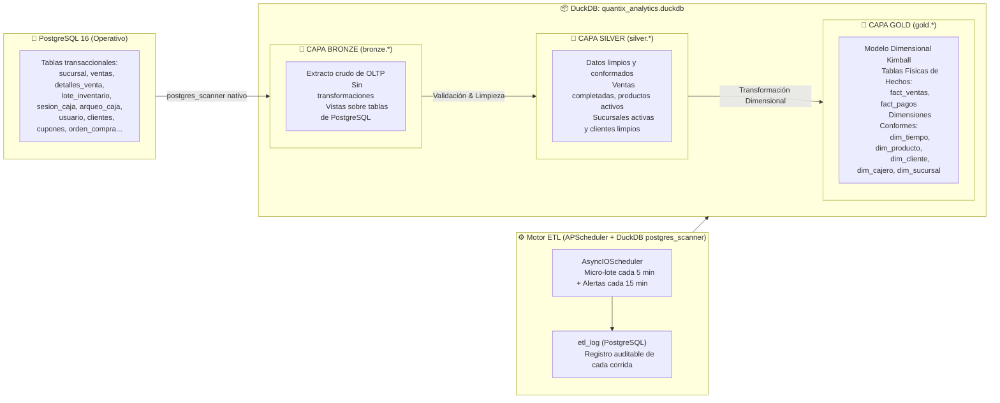

# Arquitectura Medallion ETL: Bronze → Silver → Gold

**Proyecto:** Quantix Retail OS  
**Capa:** Analítica (OLAP / DuckDB)  
**Estándar:** Medallion Architecture (Patrón Databricks adaptado a DuckDB embebido)  
**Documento vinculado:** [diseno_arquitectura_datos.md](file:///c:/Users/kacor/OneDrive/Desktop/Quantix/docs/arquitectura/diseno_arquitectura_datos.md)

---

## 1. Visión General: El Flujo Medallion

La arquitectura Medallion divide el almacén analítico en tres zonas de calidad de datos progresiva. Cada zona tiene propósito, esquema y propietario distintos, garantizando que los tableros tácticos y estratégicos nunca saturen el motor transaccional OLTP:

---

## 2. Capa Bronze: Ingesta Cruda sin Transformación

### 2.1 Propósito
La capa Bronze es el espejo directo de las tablas de PostgreSQL, accesible en DuckDB mediante el conector nativo `postgres_scanner`. Nunca se muta manualmente; refleja fielmente el estado del OLTP para garantizar reproducibilidad histórica.

### 2.2 Tablas Bronze (`bronze.*` en DuckDB)
| Tabla Bronze | Origen en PostgreSQL | Rol Analítico |
| :--- | :--- | :--- |
| `bronze.sucursal` | `sucursal` | Catálogo de sedes físicas activas e inactivas |
| `bronze.venta` | `ventas` | Encabezados de venta y comprobantes |
| `bronze.detalle_venta` | `detalles_venta` | Líneas de producto vendidas con lotes |
| `bronze.producto` | `producto` | Catálogo maestro de productos y precios |
| `bronze.categoria_producto`| `categoria` | Familias y agrupaciones de artículos |
| `bronze.cliente` | `clientes` | Padrón de clientes con Cédula y puntos |
| `bronze.usuario` | `usuario` | Directorio de cajeros y supervisores |
| `bronze.sesion_caja` | `sesion_caja` | Turnos y aperturas de gaveta |
| `bronze.pagos_venta` | `pagos_venta` | Transacciones por medio de pago |

---

## 3. Capa Silver: Datos Conformados y Limpios

### 3.1 Propósito
La capa Silver aplica reglas de filtrado y calidad: descarta ventas anuladas o pendientes de sincronización, descarta registros dados de baja lógica y normaliza identificadores y tipos de datos.

### 3.2 Vistas Silver (`silver.*` en DuckDB)
* `silver.sucursal_activa`: `SELECT * FROM bronze.sucursal WHERE activo = true;`
* `silver.venta_limpia`: `SELECT * FROM bronze.venta WHERE estado = 'COMPLETADA';`
* `silver.producto_activo`: `SELECT * FROM bronze.producto WHERE activo = true;`
* `silver.cliente_limpio`: Clientes activos con Cédula o Teléfono válidos.
* `silver.usuario_activo`: Personal en funciones activas.

---

## 4. Capa Gold: Modelo Dimensional Kimball

### 4.1 Propósito
La capa Gold materializa tablas físicas de alto rendimiento consultadas directamente por `Analisis.tsx`, `Dashboard.tsx` y el constructor dinámico de reportes `ReportePersonalizadoBuilder.tsx`.

### 4.2 Tablas de Hechos Gold (`gold.*`)
* **`gold.fact_ventas`:** Nivel de granularidad más fino (1 fila por renglón de ticket vendido). Contiene `venta_id`, `folio_ticket`, `sucursal_id`, `cajero_id`, `sesion_caja_id`, `cliente_id`, `producto_id`, `fecha_hora`, `cantidad`, `precio_unitario`, `costo_unitario`, `subtotal`, `descuento`, `impuesto`, `total_linea` y `margen_ganancia`.
* **`gold.fact_pagos`:** Desglose de cobros por método (`EFECTIVO`, `TARJETA`, `TRANSFERENCIA`, `QR`, `CUPON`) con referencia de pasarela y monto.

### 4.3 Dimensiones Conformes Gold (`gold.*`)
* **`gold.dim_sucursal`:** `sucursal_id`, `codigo`, `nombre`, `ciudad`.
* **`gold.dim_cliente`:** `cliente_id`, `cedula`, `nombre`, `telefono`, `puntos_acumulados`, `sucursal_id`.
* **`gold.dim_producto`:** `producto_id`, `sku`, `nombre`, `categoria`, `clasificacion_abc`, `precio_venta`, `costo_base`.
* **`gold.dim_cajero`:** `cajero_id`, `nombre_completo`, `email`, `rol`, `sucursal_id`.
* **`gold.dim_tiempo`:** Calendario precalculado con año, mes, día, día de la semana y hora.

---

## 5. Orquestación y Monitoreo Operativo (`Operaciones.tsx`)

### 5.1 Registro de Ejecución en PostgreSQL (`etl_log`)
Cada ciclo del pipeline persiste su trazabilidad en la tabla `etl_log` de PostgreSQL:
* `id`, `inicio`, `fin`, `duracion_ms`, `filas_procesadas`, `estado` (`EXITOSO`, `FALLIDO`), `tipo_disparo` (`PROGRAMADO`, `MANUAL`), `usuario_email` y `error_detalle`.

### 5.2 Endpoints de Control Operativo (`/api/v1/operaciones/etl`)
* `GET /api/v1/operaciones/etl/estado`: Retorna tamaño en KB de DuckDB, conteo de filas en Gold y estado del scheduler.
* `POST /api/v1/operaciones/etl/ejecutar`: Disparo manual inmediato bajo demanda.
* `GET /api/v1/operaciones/etl/historial`: Lista las últimas ejecuciones auditadas.
* `POST /api/v1/operaciones/etl/reprogramar`: Modificación de la frecuencia de micro-batch en caliente (Solo Director).
