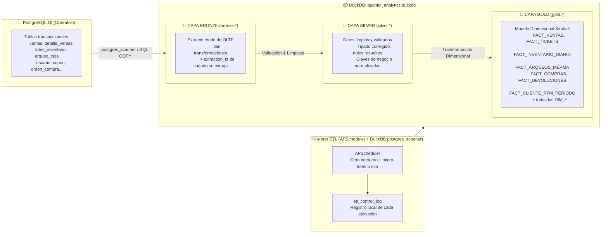

# Arquitectura Medallion ETL: Bronze → Silver → Gold

**Proyecto:** Quantix  
**Capa:** Analítica (OLAP / DuckDB)  
**Estándar:** Medallion Architecture (Delta Lake / Databricks pattern adaptado a DuckDB embebido)  
**Documento vinculado:** [diseno_arquitectura_datos.md](file:///c:/Users/kacor/OneDrive/Desktop/Quantix/docs/arquitectura/diseno_arquitectura_datos.md)

---

## 1. Visión General: El Flujo Medallion

La arquitectura Medallion divide el almacén analítico en tres zonas de calidad de datos progresiva. Cada zona tiene propósito, esquema y propietario distintos, eliminando la tentación de leer directamente del OLTP en reportes:



---

## 2. Capa Bronze: Extracción Cruda sin Transformación

### 2.1 Propósito
La capa Bronze es la **verdad inmutable de lo que llegó** desde el OLTP. Nunca se modifica manualmente. Si hay errores de datos en la fuente, se registran en Bronze tal cual y se corrigen en Silver. Esto permite reproducibilidad y auditoría completa.

### 2.2 Tablas Bronze (`bronze.*` en DuckDB)
Cada tabla Bronze es un **espejo directo** de su contraparte en PostgreSQL, añadiendo únicamente metadatos de extracción:

| Tabla Bronze | Origen OLTP | Campos adicionales |
| :--- | :--- | :--- |
| `bronze.ventas` | `ventas` | `_extraction_ts TIMESTAMPTZ`, `_source TEXT = 'pg_ventas'`, `_batch_id UUID` |
| `bronze.detalle_ventas` | `detalle_ventas` | `_extraction_ts`, `_source`, `_batch_id` |
| `bronze.productos` | `productos` | `_extraction_ts`, `_source`, `_batch_id` |
| `bronze.lotes_inventario` | `lotes_inventario` | `_extraction_ts`, `_source`, `_batch_id` |
| `bronze.clientes` | `cliente` | `_extraction_ts`, `_source`, `_batch_id` |
| `bronze.sesiones_caja` | `sesion_caja` | `_extraction_ts`, `_source`, `_batch_id` |
| `bronze.arqueos_caja` | `arqueo_caja` | `_extraction_ts`, `_source`, `_batch_id` |
| `bronze.auditoria_eventos` | `auditoria_evento` | `_extraction_ts`, `_source`, `_batch_id` |
| `bronze.proveedores` | `proveedor` | `_extraction_ts`, `_source`, `_batch_id` |
| `bronze.ordenes_compra` | `orden_compra` | `_extraction_ts`, `_source`, `_batch_id` |
| `bronze.detalle_ordenes_compra` | `detalle_orden_compra` | `_extraction_ts`, `_source`, `_batch_id` |
| `bronze.cupones` | `cupon` | `_extraction_ts`, `_source`, `_batch_id` |
| `bronze.usuarios` | `usuario` | `_extraction_ts`, `_source`, `_batch_id` (sin password_hash) |
| `bronze.pagos_venta` | `pago_venta` | `_extraction_ts`, `_source`, `_batch_id` |
| `bronze.configuracion` | `configuracion` | `_extraction_ts`, `_source`, `_batch_id` |

### 2.3 Estrategia de Extracción
* **Incrementalidad:** La mayoría de tablas usan marca de agua (`watermark`) sobre el campo de timestamp más reciente (ej. `ventas.fecha_hora`). Solo se extraen filas nuevas o modificadas desde la última ejecución exitosa.
* **Excepción de tablas de referencia:** Catálogos pequeños (`productos`, `proveedores`, `usuarios`, `configuracion`) se recargan **completos** en cada ciclo (`TRUNCATE + INSERT`).
* **Herramienta:** DuckDB `postgres_scanner` — extensión que conecta directamente a PostgreSQL sin scripts intermedios:
```sql
-- Ejemplo de extracción incremental en Bronze
INSTALL postgres; LOAD postgres;
INSERT INTO bronze.ventas
SELECT *, NOW() AS _extraction_ts, 'pg_ventas' AS _source, gen_random_uuid() AS _batch_id
FROM postgres_scan('host=localhost dbname=quantix user=quantix', 'public', 'ventas')
WHERE fecha_hora > (SELECT COALESCE(MAX(fecha_hora), '1970-01-01') FROM bronze.ventas);
```

---

## 3. Capa Silver: Limpieza, Validación y Normalización

### 3.1 Propósito
La capa Silver aplica reglas de calidad de datos. Un registro llega a Silver **solo si supera las validaciones**; los que fallan se registran en `silver.rejection_log` para auditoría y corrección en la fuente.

### 3.2 Reglas de Calidad por Tabla

| Tabla Silver | Validaciones Aplicadas | Transformaciones |
| :--- | :--- | :--- |
| `silver.ventas` | `total_pagar >= 0`, `fecha_hora IS NOT NULL`, `estado IN ('COMPLETADA','ANULADA','DEVUELTA')` | Extraer `fecha_hora` en componentes (año, mes, día, hora) |
| `silver.detalle_ventas` | `cantidad > 0`, `precio_unitario_cobrado >= 0`, `costo_unitario_lote >= 0` | Calcular `margen_pct = (precio - costo) / precio * 100` |
| `silver.lotes_inventario` | `fecha_vencimiento IS NOT NULL`, `cantidad_disponible >= 0` | Calcular `dias_para_vencer = fecha_vencimiento - TODAY()` |
| `silver.clientes` | Deduplicación por `telefono`, `email` válido si presente | Normalizar teléfono a formato estándar |
| `silver.arqueos_caja` | `efectivo_contado >= 0`, `diferencia IS NOT NULL` | Clasificar: `es_faltante = diferencia < 0` |
| `silver.auditoria_eventos` | `fecha_hora IS NOT NULL`, `tipo_evento IS NOT NULL` | — |

```sql
-- Ejemplo Silver: detalle_ventas validado
INSERT INTO silver.detalle_ventas
SELECT
    dv.*,
    ROUND((dv.precio_unitario_cobrado - dv.costo_unitario_lote) 
          / NULLIF(dv.precio_unitario_cobrado, 0) * 100, 2) AS margen_pct_calculado
FROM bronze.detalle_ventas dv
WHERE dv.cantidad > 0
  AND dv.precio_unitario_cobrado >= 0
  AND dv.costo_unitario_lote >= 0
  AND dv._batch_id NOT IN (SELECT batch_id FROM silver.detalle_ventas);
```

### 3.3 Tabla de Rechazos
```sql
CREATE TABLE silver.rejection_log (
    id            UUID DEFAULT gen_random_uuid() PRIMARY KEY,
    tabla_origen  TEXT NOT NULL,
    batch_id      UUID NOT NULL,
    record_id     TEXT NOT NULL,  -- PK del registro rechazado
    motivo        TEXT NOT NULL,
    campo_fallido TEXT,
    valor_fallido TEXT,
    registrado_en TIMESTAMPTZ DEFAULT now()
);
```

---

## 4. Capa Gold: Modelo Dimensional Kimball (Tablas de Hechos y Dimensiones)

### 4.1 Propósito
La capa Gold contiene el esquema dimensional final consultado directamente por los tableros tácticos (MIS/DSS) y estratégicos (EIS/BI). Se construye desde Silver; nunca desde Bronze ni desde PostgreSQL directamente.

### 4.2 Tablas de Hechos Gold (`gold.*`)

| Tabla Gold | Grano | Origen Silver | Actualización |
| :--- | :--- | :--- | :--- |
| `gold.fact_ventas` | 1 línea de detalle por ticket | `silver.detalle_ventas` + `silver.ventas` | Micro-lote 5 min |
| `gold.fact_tickets` | 1 ticket completo | `silver.ventas` | Micro-lote 5 min |
| `gold.fact_inventario_diario` | 1 SKU-Sucursal-Día | `silver.lotes_inventario` | Cron nocturno |
| `gold.fact_arqueos_merma` | 1 cierre de turno | `silver.arqueos_caja` | Micro-lote 5 min |
| `gold.fact_compras` | 1 línea de orden de compra | `silver.detalle_ordenes_compra` | Cron nocturno |
| `gold.fact_devoluciones` | 1 línea de devolución | `silver.ventas` (estado = DEVUELTA) | Micro-lote 5 min |
| `gold.fact_cliente_rfm_periodo` | 1 cliente-periodo mensual | `silver.ventas` + `silver.clientes` | Cron nocturno |

### 4.3 Tablas de Dimensiones Gold (`gold.*`)

| Dimensión | Tipo SCD | Descripción |
| :--- | :--- | :--- |
| `gold.dim_tiempo` | Estática | Calendario completo generado una vez (2020-2030) |
| `gold.dim_producto` | SCD Tipo 2 | Historial de cambios de precio y clasificación estratégica |
| `gold.dim_cliente` | SCD Tipo 1 | Identidad estable del cliente |
| `gold.dim_sucursal_caja` | SCD Tipo 1 | Sucursales y terminales |
| `gold.dim_empleado` | SCD Tipo 1 | Personal operativo |
| `gold.dim_metodo_pago` | Estática | Medios y pasarelas de pago |
| `gold.dim_proveedor` | SCD Tipo 1 | Proveedores activos |

---

## 5. Control de Ejecución ETL: Registro Local de Pipelines

### 5.1 Tabla `etl_control_log` (en DuckDB — esquema `control`)

Cada ejecución del pipeline ETL genera exactamente **una fila** en `etl_control_log` por tabla y capa procesada:

```sql
CREATE SCHEMA control;
CREATE TABLE control.etl_control_log (
    id                 UUID DEFAULT gen_random_uuid() PRIMARY KEY,
    -- Identificación
    pipeline_name      TEXT NOT NULL,         -- 'bronze_ventas', 'silver_detalle_ventas', etc.
    capa               TEXT NOT NULL,         -- 'BRONZE' | 'SILVER' | 'GOLD'
    tabla_destino      TEXT NOT NULL,         -- 'bronze.ventas', 'silver.ventas', etc.
    tabla_origen       TEXT,                  -- 'public.ventas' o capa previa
    -- Temporalidad
    inicio             TIMESTAMPTZ NOT NULL,
    fin                TIMESTAMPTZ,
    duracion_segundos  DOUBLE,
    -- Resultado
    estado             TEXT NOT NULL,         -- 'RUNNING' | 'SUCCESS' | 'FAILED' | 'PARTIAL'
    filas_leidas       BIGINT DEFAULT 0,
    filas_insertadas   BIGINT DEFAULT 0,
    filas_rechazadas   BIGINT DEFAULT 0,
    -- Trazabilidad
    watermark_inicio   TIMESTAMPTZ,           -- Marca de agua de inicio del batch
    watermark_fin      TIMESTAMPTZ,           -- Máximo timestamp procesado en este ciclo
    batch_id           UUID,                  -- ID único del lote procesado
    -- Error
    error_tipo         TEXT,
    error_mensaje      TEXT,
    stack_trace        TEXT
);

CREATE INDEX idx_etl_control_estado ON control.etl_control_log(estado, inicio DESC);
CREATE INDEX idx_etl_control_pipeline ON control.etl_control_log(pipeline_name, inicio DESC);
```

### 5.2 Ciclo de Vida de una Ejecución ETL

```python
# Patrón de uso en backend/app/etl/pipeline.py
async def run_pipeline_step(pipeline_name: str, capa: str, tabla_destino: str, ...):
    batch_id = uuid4()
    log_id = etl_log.start(pipeline_name, capa, tabla_destino, batch_id)
    try:
        rows_read, rows_inserted, rows_rejected = await extract_and_load(...)
        etl_log.success(log_id, rows_read, rows_inserted, rows_rejected, watermark_fin)
    except Exception as e:
        etl_log.failed(log_id, error_tipo=type(e).__name__, mensaje=str(e))
        raise
```

### 5.3 Frecuencia y Esquema de Orquestación con APScheduler

```
APScheduler Jobs (embebidos en FastAPI al arrancar):

  ┌─────────────────────────────────────────────────────────┐
  │  JOB: etl_micro_batch (cada 5 minutos, entre 6AM-11PM) │
  │  Bronze: ventas, detalle_ventas, pagos_venta,           │
  │          sesiones_caja, arqueos_caja, auditoria_eventos │
  │  Silver: ventas, detalle_ventas, pagos_venta,           │
  │          sesiones_caja, arqueos_caja                    │
  │  Gold:   fact_ventas, fact_tickets, fact_arqueos_merma  │
  └─────────────────────────────────────────────────────────┘
  ┌─────────────────────────────────────────────────────────┐
  │  JOB: etl_nightly_batch (02:00 AM diario)              │
  │  Bronze: todos los catálogos completos                  │
  │  Silver: lotes_inventario, clientes, proveedores        │
  │  Gold:   fact_inventario_diario, fact_compras,          │
  │          fact_devoluciones, fact_cliente_rfm_periodo,   │
  │          dim_producto (SCD Tipo 2)                      │
  └─────────────────────────────────────────────────────────┘
```

---

## 6. Política de Datos Reales

> [!CAUTION]
> **Quantix trabaja exclusivamente con datos reales. Todos los datos de negocio deben ingresar únicamente a través de la Capa Operativa (PostgreSQL vía la API de Quantix).**

### Reglas Irrevocables:
1. **Prohibición de datos sintéticos persistentes:** Ningún agente de programación, script o migración puede insertar registros ficticios (ej. `"Producto Test"`, `"Cliente Prueba"`) en la base de datos operativa de producción ni en las capas Bronze/Silver/Gold.
2. **Datos de prueba: uso temporal y borrado obligatorio:** Si durante el desarrollo se requiere crear registros para validar una funcionalidad, deben borrarse completamente antes del commit de la tarea. Los tests unitarios y de integración deben usar transacciones que se revierten automáticamente (`@pytest.mark.asyncio` con rollback), nunca datos reales ni datos ficticios persistentes.
3. **Flujo único de ingesta:** Los datos reales solo entran al sistema a través de la API operativa (endpoints de ventas, recepción de inventario, alta de clientes, etc.). Cualquier inserción directa a PostgreSQL sin pasar por la API es una violación de la integridad del sistema.
4. **El pipeline ETL es de solo lectura sobre el OLTP:** El ETL nunca modifica datos en PostgreSQL. Solo lee y escribe en DuckDB.
