# Stack Tecnológico y Plan de Implementación (Sprint 2 Días)

**Proyecto:** Quantix  
**Objetivo:** Prototipo funcional completo, modular y listo para producción ligera en 48 horas.  
**Equipo de ejecución:** Agentes de Programación de IA.  
**Documentos vinculados:**
* [estrategia_negocios.md](file:///c:/Users/kacor/OneDrive/Desktop/Quantix/docs/negocio/estrategia_negocios.md)
* [analisis_organizacional.md](file:///c:/Users/kacor/OneDrive/Desktop/Quantix/docs/negocio/analisis_organizacional.md)
* [diseno_arquitectura_datos.md](file:///c:/Users/kacor/OneDrive/Desktop/Quantix/docs/arquitectura/diseno_arquitectura_datos.md)
* [especificacion_requisitos.md](file:///c:/Users/kacor/OneDrive/Desktop/Quantix/docs/requisitos/especificacion_requisitos.md)

---

## 1. Selección Justificada del Stack

### 1.1 Backend & API
* **Tecnología:** **Python 3.11+ / FastAPI**
* **ORM:** **SQLAlchemy 2.0 + Pydantic v2**
* **Justificación:**
  * Auto-generación de documentación interactiva Swagger (`/docs`) para pruebas inmediatas de agentes.
  * Mismo lenguaje para la lógica transaccional y el procesamiento analítico de datos.
  * Desempeño asíncrono nativo para operaciones de caja de baja latencia (< 200 ms).

### 1.2 Base de Datos Operativa (OLTP)
* **Tecnología:** **PostgreSQL 16** (vía Docker Compose ligero)
* **Justificación:**
  * Consistencia ACID obligatoria para arqueos ciegos y cobro de ventas.
  * Manejo estricto de restricciones e integridad referencial (llaves foráneas, índices únicos en teléfono y SKU).

### 1.3 Base de Datos Analítica (OLAP)
* **Tecnología:** **DuckDB**
* **Justificación:**
  * Motor columnar de alto rendimiento embebido (formato archivo `.duckdb`), eliminando la necesidad de levantar ClickHouse o Snowflake.
  * Capacidad de consultar directamente tablas de PostgreSQL mediante la extensión `postgres_scanner`.
  * Optimizado para agregaciones masivas en los tableros tácticos (caducidades FEFO) y estratégicos (márgenes, RFM, LTV).

### 1.4 Orquestación del Pipeline ETL (Alternativa a Airflow)
* **Decisión:** **APScheduler (Python) embebido en FastAPI**
* **Por qué NO Airflow:** Airflow consume entre 2 y 4 GB de RAM, requiere múltiples contenedores (Webserver, Scheduler, Celery/Redis, Postgres metastore) y su configuración consumiría más del 30% del tiempo total del sprint.
* **Mecanismo adoptado:**
  * Un módulo Python (`app/etl/pipeline.py`) ejecutado periódicamente (ej. cada 15 minutos o bajo demanda vía endpoint `/api/admin/trigger-etl`).
  * Ejecuta transformaciones SQL idóneas que leen de PostgreSQL y actualizan las tablas de hechos (`FACT_VENTAS`, `FACT_INVENTARIO_DIARIO`, `FACT_ARQUEOS_MERMA`) en DuckDB.

### 1.5 Frontend
* **Tecnología:** **React 18 + Vite + Tailwind CSS + Lucide React + Recharts**
* **Justificación:**
  * Alta ergonomía para el POS (atajos de teclado, UI táctil).
  * Máxima fiabilidad de generación de código en modelos de lenguaje (menor tasa de errores de compilación).
  * Visualizaciones directas con Recharts para los tableros tácticos y estratégicos.

---

## 2. Estructura del Repositorio

```
Quantix/
├── docker-compose.yml           # PostgreSQL 16
├── backend/
│   ├── app/
│   │   ├── core/                # Configuración, variables de entorno, seguridad
│   │   ├── db/
│   │   │   ├── oltp.py          # Conexión SQLAlchemy a PostgreSQL
│   │   │   └── olap.py          # Conexión DuckDB
│   │   ├── models/              # Modelos ORM (OLTP)
│   │   ├── schemas/             # Esquemas Pydantic
│   │   ├── api/
│   │   │   ├── pos.py           # Endpoints de venta y cobro rápido
│   │   │   ├── inventario.py    # Lotes, entradas y alertas FEFO
│   │   │   ├── caja.py          # Sesiones y arqueo ciego
│   │   │   ├── analitica.py     # Endpoints BI que leen de DuckDB
│   │   │   ├── auth.py          # (Nuevo) Endpoints de login y roles
│   │   │   ├── dashboard.py     # (Nuevo) Endpoints Z/T distribuciones
│   │   │   └── ws.py            # (Nuevo) WebSockets para notificaciones
│   │   ├── etl/
│   │   │   ├── pipeline.py      # Transformación OLTP -> DuckDB
│   │   │   └── scheduler.py     # Tarea programada con APScheduler
│   │   └── main.py              # Entrada FastAPI
│   ├── requirements.txt
│   └── Dockerfile
│
├── frontend/
│   ├── src/
│   │   ├── components/          # UI compartida (botones, modales, alertas)
│   │   ├── pages/
│   │   │   ├── POSPage.tsx      # Terminal de venta y cobro rápido
│   │   │   ├── ArqueoPage.tsx   # Cuadre ciego de caja
│   │   │   ├── InventarioPage.tsx # FEFO y control de stock
│   │   │   └── DashboardPage.tsx  # Métricas tácticas y estratégicas
│   │   ├── services/            # Cliente Axios/Fetch para el API
│   │   └── App.tsx
│   ├── package.json
│   └── vite.config.ts
│
└── docs/                        # Documentación generada previamente
```

---

## 3. Plan de Ejecución en 2 Días (Roadmap para Agentes)

```mermaid
gantt
    title Plan de Ejecución Quantix (48 Horas)
    dateFormat  HH:mm
    axisFormat  %Hh

    section Día 1: Core Operativo (OLTP)
    Configuración Entorno & Docker       :d1_1, 00:00, 3h
    Modelos de Datos & Migraciones       :d1_2, after d1_1, 4h
    API POS, Cobro & Identificación      :d1_3, after d1_2, 6h
    Lógica FEFO & Arqueo Ciego           :d1_4, after d1_3, 5h
    UI POS Básica en React               :d1_5, after d1_4, 6h

    section Día 2: Analítica & Integración
    Setup DuckDB & Pipeline ETL          :d2_1, after d1_5, 5h
    Consultas Tácticas & Estratégicas    :d2_2, after d2_1, 5h
    UI Dashboards (Mermas, Margen, RFM)  :d2_3, after d2_2, 6h
    Pruebas E2E & Validaciones de Negocio:d2_4, after d2_3, 5h
    Entrega & Documentación Final        :d2_5, after d2_4, 3h
```



### Detalle de Tareas:

#### DÍA 1: El Motor Transaccional (Capa Operativa)
1. **Infraestructura Base:**
   * Archivo `docker-compose.yml` para levantar PostgreSQL 16 con volumen persistente.
   * Inicialización del backend con FastAPI y frontend con Vite + React.
2. **Modelos de Datos Relacionales (OLTP):**
   * Crear tablas de `clientes`, `productos`, `lotes_inventario`, `ventas`, `detalle_ventas`, `pagos_venta`, `sesiones_caja`, `arqueos_caja` y `auditoria_eventos`.
3. **Lógica de Negocio Crítica:**
   * **Cobro ágil:** Endpoint de checkout con cálculo automático de márgenes congelados por lote.
   * **Inventario FEFO:** Endpoint de venta que descuenta primero el lote con fecha de caducidad más cercana.
   * **Arqueo Ciego:** Endpoint de cierre que recibe conteo físico del cajero, calcula diferencias y notifica discrepancias sin mostrar saldo teórico en pantalla.
4. **Pantalla POS (Terminal de Caja):**
   * Interfaz minimalista con buscador rápido, captura rápida de teléfono de cliente y modal de cobro mixto.

---

#### DÍA 2: Inteligencia de Datos & Integración (Capa Analítica)
1. **Pipeline ETL con DuckDB:**
   * Script `pipeline.py` que lee del Postgres operativo y vuelca a tablas dimensionales en `quantix_analytics.duckdb`.
   * Programación con `APScheduler` para ejecutar la sincronización de forma transparente.
2. **Cálculo de Métricas Tácticas y Estratégicas:**
   * Táctico: Detección de lotes con caducidad < 15 días y reporte de cajeros con descuadres recurrentes.
   * Estratégico: Matriz de 4 cuadrantes (margen vs. rotación - productos gancho vs. nicho) y segmentación de clientes RFM con cálculo de LTV.
3. **Tableros en Frontend (React + Recharts):**
   * Vista de administración con métricas de mermas, caducidades y rentabilidad real.
4. **Verificación Integral:**
   * Simulación de flujo completo: Ingreso de stock con lotes -> Venta rápida en POS -> Arqueo ciego -> Ejecución del ETL -> Visualización de KPIs en el Dashboard.
