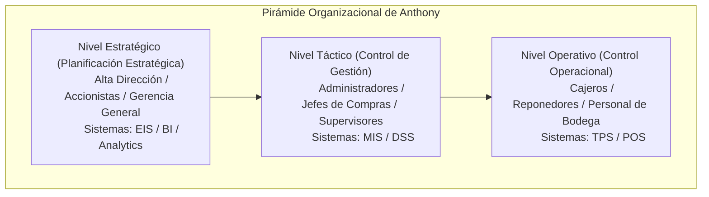
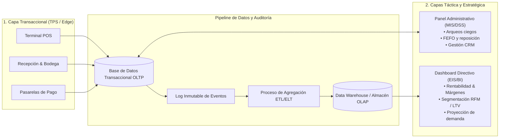

# Análisis Organizacional y Arquitectura de Sistemas: Modelo de Anthony

Este documento establece el marco organizacional y el diseño conceptual de la arquitectura de información para **Quantix**, fundamentado en el **Modelo de la Pirámide de Anthony (Robert Anthony, 1965)** y alineado directamente con los pilares definidos en [estrategia_negocios.md](file:///c:/Users/kacor/OneDrive/Desktop/Quantix/docs/negocio/estrategia_negocios.md).

---

## 1. Marco Filosófico e Identidad Corporativa

### Misión
> *"Empoderar a los comercios minoristas con un ecosistema tecnológico ágil, seguro e inteligente que maximice su rentabilidad, elimine las pérdidas operativas y transforme cada transacción en una relación duradera con el cliente."*

### Visión
> *"Ser la plataforma integral líder de gestión comercial y punto de venta para el comercio moderno, reconocida por democratizar el análisis predictivo, la optimización de precios y el control preventivo de inventarios en negocios de cualquier escala."*

### Propósito y Principios Rectores
1. **Velocidad sin fricción:** Cada interacción en caja debe resolverse en segundos para proteger la experiencia del cliente y la venta.
2. **Decisiones guiadas por el margen:** Sustituir la intuición por el conocimiento exacto de la rentabilidad unitaria y el coste de reposición.
3. **Cero tolerancia a la fuga de valor:** Prevenir mermas por caducidad, sobrestock y descuadres de caja mediante controles ciegos y auditoría continua.
4. **Relaciones basadas en datos:** Tratar a cada cliente según su valor acumulado y su ciclo real de consumo, no mediante ofertas desesperadas.

---

## 2. El Modelo de Anthony (Pirámide Organizacional)

El modelo de Anthony estructura los sistemas de información según el nivel de toma de decisiones en la empresa:

---

## 3. Desglose Organizacional por Niveles

### A. Nivel Operativo: Control Operacional
* **Población / Usuarios:** Cajeros, reponedores de tienda, personal de recepción de mercancía.
* **Horizonte temporal:** Tiempo real, turnos diarios (segundos a horas).
* **Naturaleza de la información:** Altamente estructurada, detallada, transaccional, repetitiva y de volumen masivo.
* **Tipo de Sistema (SI):** **TPS** (*Transaction Processing System*) / **POS** (*Point of Sale*).

#### Procesos Clave:
* **Venta y Cobro de Alta Velocidad:** Lectura por código de barras, integración nativa con terminales de pago electrónico (datáfonos, contactless, billeteras digitales).
* **Captura Rápida de Identidad:** Registro no invasivo del cliente en caja (vía número de teléfono o QR de fidelización).
* **Recepción y Ubicación de Stock:** Ingreso físico de mercancía con registro de lote y fecha de vencimiento.
* **Arqueo Ciego de Caja:** Conteo físico de dinero y comprobantes al cierre de turno, sin mostrar el total teórico esperado por el sistema.

#### Requerimientos del Sistema:
* Latencia ultra-baja: búsqueda/escaneo de artículo < 200 ms; cierre completo de venta (descarga de stock + emisión de ticket) < 1.5 segundos.
* Capacidad de operación **Offline-first** (resistencia a caídas de conectividad).
* Interfaz intuitiva y ergonómica (optimizada para teclado y pantallas táctiles).

---

### B. Nivel Táctico: Control de Gestión
* **Población / Usuarios:** Administradores de sucursal, jefes de compras, supervisores de turno, encargados de inventario.
* **Horizonte temporal:** Semanal, mensual, trimestral.
* **Naturaleza de la información:** Agregada periódicamente, comparativa, orientada al control interno y cumplimiento de metas.
* **Tipo de Sistema (SI):** **MIS** (*Management Information System*) y **DSS** (*Decision Support System*).

#### Procesos Clave:
* **Control de Mermas y Fraude Interno:** Conciliación de arqueos ciegos, detección de diferencias de caja recurrentes, auditoría de anulaciones y descuentos manuales.
* **Gestión de Caducidades FEFO (*First Expired, First Out*):** Alertas preventivas de productos próximos a vencer para activar promociones de liquidación antes de que se conviertan en pérdida.
* **Reaprovisionamiento Inteligente:** Determinación del *punto de reorden* considerando tiempos de entrega de proveedores para evitar quiebres de stock o sobrestock.
* **Automatización de Fidelización:** Programación de cupones de cumpleaños y reglas de contacto para clientes cuyo ciclo intercompra habitual se ha sobrepasado.

#### Requerimientos del Sistema:
* Motor de alertas configurables (vencimientos, rotura de stock, descuadres de caja).
* Matriz de roles y permisos (RBAC) con autorizaciones multinivel.
* Generación de órdenes de compra sugeridas con base en consumo real.

---

### C. Nivel Estratégico: Planificación Estratégica
* **Población / Usuarios:** Socios, Directores Generales, Director Financiero (CFO).
* **Horizonte temporal:** Semestral, anual y plurianual (largo plazo).
* **Naturaleza de la información:** Altamente sintetizada, gráfica, orientada a tendencias, rentabilidad global y escenarios futuros.
* **Tipo de Sistema (SI):** **EIS** (*Executive Information System*) / **BI** (*Business Intelligence*).

#### Procesos Clave:
* **Estrategia de Precios y Margen Dinámico:** Monitoreo de la matriz de productos *loss leader* (alta rotación a bajo margen para generar tráfico) contra productos de nicho de alta rentabilidad.
* **Análisis de Ciclo de Vida del Cliente (LTV):** Segmentación RFM (*Recency, Frequency, Monetary*) para identificar el valor real a largo plazo de la base de clientes.
* **Evaluación de Rendimiento de Capital:** Medición del GMROI (*Gross Margin Return on Investment*) sobre inventario y evaluación del impacto total de mermas sobre la utilidad neta anual.
* **Simulación de Escenarios (*What-If*):** Proyección del impacto financiero ante variaciones de costes de proveedores o cambios en la política de descuentos.

#### Requerimientos del Sistema:
* Cuadros de mando (dashboards) ejecutivos con KPIs consolidados.
* Informes de demanda desestacionalizada y modelos de proyección multivariable.
* Análisis de rentabilidad considerando el coste de reposición más reciente.

---

## 4. Arquitectura de Sistemas Alineada con la Pirámide

Para garantizar que el flujo de datos sea fluido y que las consultas analíticas pesadas no degraden la velocidad del punto de cobro, la arquitectura de **Quantix** se organiza en tres capas desacopladas:

### Principios de Diseño Arquitectónico:
1. **Segregación OLTP vs. OLAP:**
   * La operativa de tienda lee y escribe en bases de datos transaccionales de alta disponibilidad (**OLTP**).
   * La analítica táctica y directiva consulta almacenes de datos agregados (**OLAP**), protegiendo la velocidad de las cajas.
2. **Trazabilidad Ascendente y Descendente:**
   * Cualquier métrica estratégica (ej. margen bruto mensual de una categoría) permite hacer *drill-down* hasta la transacción y el lote específico de origen.
3. **Seguridad y Auditoría Inmutable:**
   * Todas las operaciones sensibles (aperturas de cajón sin venta, cancelaciones, descuentos manuales, modificaciones de precios) generan registros de auditoría no editables.

---

## 5. Matriz de Trazabilidad: Estrategia vs. Niveles de Anthony

| Pilar Estratégico ([estrategia_negocios.md](file:///c:/Users/kacor/OneDrive/Desktop/Quantix/docs/negocio/estrategia_negocios.md)) | Nivel Operativo (TPS / POS) | Nivel Táctico (MIS / DSS) | Nivel Estratégico (EIS / BI) |
| :--- | :--- | :--- | :--- |
| **1. Agilidad y Pagos** | Cobro en < 2 seg; datáfono integrado con auto-conciliación. | Monitoreo de tiempos de atención y colas por turno/cajero. | Tasa de adopción de pagos electrónicos y costo financiero de pasarelas. |
| **2. Precios y Margen** | Cobro con precios centralizados y aplicación automática de promociones. | Alerta por cambio de coste de compra de proveedores; control de precios. | Matriz de márgenes (productos gancho vs. nicho); análisis de rentabilidad. |
| **3. Fidelización** | Identificación rápida del cliente (teléfono/QR) sin demorar la fila. | Campañas automatizadas de cupones de cumpleaños y reactivación. | Medición del ROI del programa de fidelización y tasa de retención anual. |
| **4. Hábitos y LTV** | Canje de cupones y visualización de beneficios del cliente. | Detección de desviación de compras vs. ciclo habitual del cliente. | Segmentación RFM y cálculo del Valor de Vida del Cliente (LTV). |
| **5. Inventario y Demanda** | Registro de lotes y fechas de vencimiento al ingresar mercadería. | Gestión de caducidades FEFO y cálculo de punto de reorden. | Rotación global de inventario y optimización de capital de trabajo inmovilizado. |
| **6. Control de Merma y Seguridad** | Arqueo ciego obligatorio y captura biométrica/PIN en anulaciones. | Detección de descuadres de caja, mermas físicas y patrones de robo hormiga. | Porcentaje de merma sobre utilidad neta anual y diagnóstico de vulnerabilidad. |
