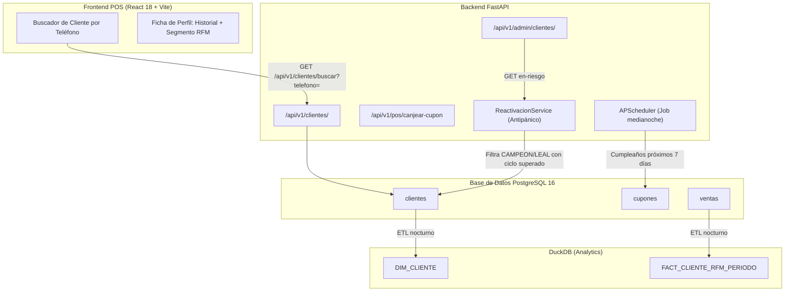

# Plan de Implementación Técnica: 002 - Clientes, Segmentación RFM y Fidelización

**Módulo:** 002-clientes-fidelizacion  
**Objetivo:** Implementar la captura de clientes en POS, el motor de segmentación RFM/LTV en DuckDB y la automatización de cupones de cumpleaños y reactivación antipánico.

---

## 1. Arquitectura de Componentes



---

## 2. Fases de Implementación

### Fase 1: Captura Rápida de Cliente en POS
- El teléfono es la clave de búsqueda única en el POS.
- Alta rápida: solo se requieren `telefono` y `nombre` para no detener la cola de cobro (< 3 segundos).
- El componente de búsqueda en POS ejecuta `GET /api/v1/clientes/buscar?telefono=` con debounce de 300 ms.

### Fase 2: Motor de Ciclo Intercompra
- Para cada cliente se calcula la media de intervalos en días entre compras consecutivas.
- Fórmula Python:
  ```python
  fechas = sorted([v.fecha_hora for v in compras_cliente])
  intervalos = [(fechas[i] - fechas[i-1]).days for i in range(1, len(fechas))]
  ciclo_intercompra_dias = mean(intervalos) if intervalos else None
  ```
- El campo `ciclo_intercompra_dias` se persiste en la tabla `clientes` y se recalcula en cada nueva compra del cliente.

### Fase 3: ETL Periódico de Segmentación RFM y LTV en DuckDB
- Job nocturno que lee las tablas OLTP (`ventas`, `detalle_ventas`, `clientes`) y recalcula:
  - **Recency:** días desde la última compra.
  - **Frequency:** número de compras en el periodo.
  - **Monetary:** gasto total en el periodo.
- Resultados persistidos en `FACT_CLIENTE_RFM_PERIODO` con columnas de segmento (`CAMPEON`, `LEAL`, `EN_RIESGO`, `DORMIDO`).
- El LTV se estima como `monetary_pct * frequency_score * (1 / recency_normalizado)`.

### Fase 4: Automatización de Cupones de Cumpleaños
- Job APScheduler que corre a medianoche diariamente.
- Consulta clientes donde `fecha_nacimiento` cae dentro de los próximos 7 días y `opt_in_marketing = TRUE`.
- Inserta registros en la tabla `cupones` con `tipo_cupon = 'CUMPLEANOS'`, válido por 7 días a partir de la fecha de cumpleaños.

### Fase 5: Reactivación Antipánico
- Filtra clientes con segmento `CAMPEON` o `LEAL` cuyo `dias_sin_comprar > ciclo_intercompra_dias * multiplicador_rfm`.
- `multiplicador_rfm` es un parámetro configurable en la tabla `CONFIGURACION` con clave `rfm_multiplicador_reactivacion` (valor por defecto: `1.5`).
- El endpoint `GET /api/v1/admin/clientes/en-riesgo` expone la lista para intervención del equipo de marketing.

---

## 3. Dependencias

| Módulo | Motivo |
|--------|--------|
| **001-core-ventas-inventario** | Provee las tablas `ventas` y `detalle_ventas` sobre las que se calcula el RFM. |
