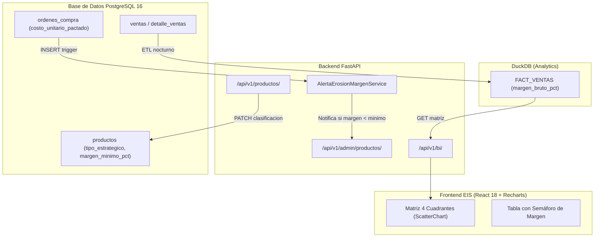

# Plan de Implementación Técnica: 003 - Precios y Márgenes

**Módulo:** 003-precios-margenes  
**Objetivo:** Implementar la clasificación estratégica de productos, la alerta de erosión de margen al registrar compras y la visualización analítica de la matriz margen-rotación en el dashboard EIS.

---

## 1. Arquitectura de Componentes



---

## 2. Fases de Implementación

### Fase 1: Clasificación Estratégica de Catálogo
- Cada producto tiene un campo `tipo_estrategico` con valores `GANCHO`, `NICHO` o `REGULAR`.
- Solo usuarios con rol `Director` pueden modificar este campo.
- El endpoint `PATCH /api/v1/productos/{id}/clasificacion` actualiza únicamente este campo y registra el cambio en `AUDITORIA_EVENTO`.

### Fase 2: Alerta de Erosión de Margen
- Al registrar una nueva `ORDEN_COMPRA`, el servicio calcula si el `costo_unitario_pactado` supera el umbral:
  ```
  costo_unitario_pactado > precio_venta * (1 - margen_minimo_pct / 100)
  ```
- Si se cumple la condición, el sistema emite una notificación al rol `Supervisor` y registra el evento en `AUDITORIA_EVENTO`.

### Fase 3: Cálculo de Margen en Línea de Venta
- En cada `detalle_ventas`, el margen de línea se calcula y persiste automáticamente:
  ```
  margen_linea_pct = (precio_cobrado - costo_unitario_lote) / precio_cobrado * 100
  ```
- Este valor queda congelado en la fila para trazabilidad histórica.

### Fase 4: Matriz de 4 Cuadrantes en Dashboard EIS
- Visualización `ScatterChart` de Recharts con:
  - **Eje X:** Rotación del producto (ventas/día en últimos 30 días, de `004-pronostico-demanda`).
  - **Eje Y:** Margen bruto promedio (`margen_bruto_pct` de `FACT_VENTAS`).
- Cuadrantes: Alta Rotación + Alto Margen (Estrella), Alta Rotación + Bajo Margen (Volumen), Baja Rotación + Alto Margen (Nicho), Baja Rotación + Bajo Margen (Revisar).
- Color de punto según `tipo_estrategico`: GANCHO=azul, NICHO=verde, REGULAR=gris.

---

## 3. Dependencias

| Módulo | Motivo |
|--------|--------|
| **001-core-ventas-inventario** | Provee `ventas`, `detalle_ventas` y la tabla `productos` base. |
| **004-pronostico-demanda** | Provee la métrica de rotación (velocidad_venta_diaria) usada en el eje X de la matriz. |
