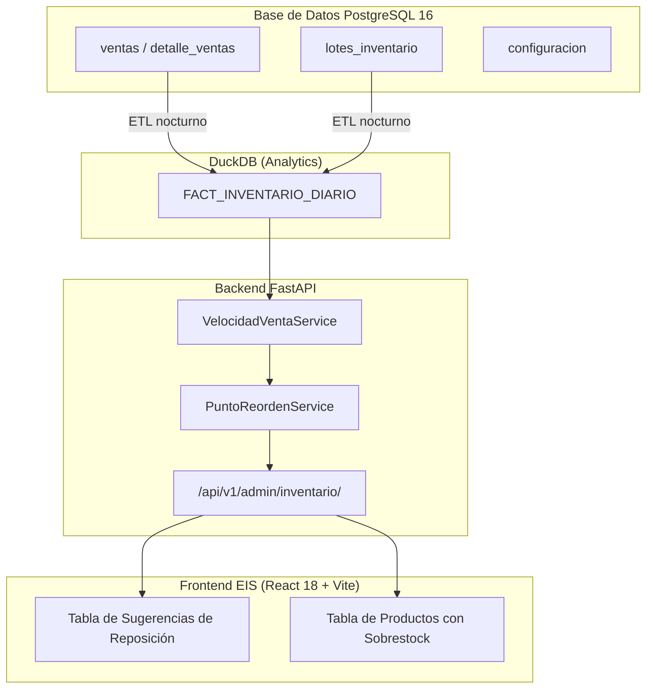

# Plan de Implementación Técnica: 004 - Pronóstico de Demanda y Reposición

**Módulo:** 004-pronostico-demanda  
**Objetivo:** Implementar el cálculo de velocidad de venta diaria por SKU, el punto de reorden automático y la detección de sobrestock para generar sugerencias de compra accionables.

---

## 1. Arquitectura de Componentes



---

## 2. Fases de Implementación

### Fase 1: ETL de FACT_INVENTARIO_DIARIO
- Job nocturno que calcula, para cada SKU y cada día del periodo, el stock disponible al cierre del día.
- Marca los días con `stock_disponible = 0` en el campo `cantidad_rotura_stock` para excluirlos del cálculo de velocidad.

### Fase 2: Velocidad de Venta Diaria
- Fórmula que excluye los días con rotura de stock:
  ```sql
  SELECT producto_id,
         SUM(unidades_vendidas) / COUNT(*) FILTER (WHERE cantidad_rotura_stock = 0) AS velocidad_venta_diaria
  FROM FACT_INVENTARIO_DIARIO
  WHERE fecha >= CURRENT_DATE - INTERVAL '30 days'
  GROUP BY producto_id;
  ```
- Si todos los días del periodo tienen rotura de stock, `velocidad_venta_diaria` queda en `NULL` y no se genera sugerencia.

### Fase 3: Cálculo del Punto de Reorden
- Para cada SKU y su proveedor preferido (menor `lead_time_dias`):
  ```
  stock_seguridad = velocidad_diaria × desviacion_estandar_demanda × factor_seguridad
  punto_reorden   = (velocidad_venta_diaria × lead_time_dias) + stock_seguridad
  ```
- `factor_seguridad` se lee de la clave `stock_seguridad_factor` en la tabla `CONFIGURACION` (valor por defecto: `1.65`, equivalente al 95 % de nivel de servicio).

### Fase 4: Detección de Sobrestock
- Un producto entra en sobrestock si:
  ```
  dias_inventario_proyectados = stock_disponible_total / velocidad_venta_diaria
  dias_inventario_proyectados > inventario_dias_sobrestock  (clave en CONFIGURACION, default: 90)
  ```
- Se expone la lista en el endpoint `GET /api/v1/admin/inventario/sobrestock`.

---

## 3. Dependencias

| Módulo | Motivo |
|--------|--------|
| **001-core-ventas-inventario** | Provee `ventas`, `detalle_ventas` y `lotes_inventario` como fuente de datos. |
