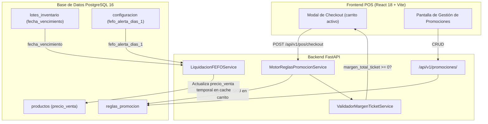

# Plan de Implementación Técnica: 005 - Promociones Inteligentes

**Módulo:** 005-promociones-inteligentes  
**Objetivo:** Implementar el motor de evaluación de reglas de combo, la validación de margen mínimo de ticket y la liquidación automática FEFO en precios.

---

## 1. Arquitectura de Componentes



---

## 2. Fases de Implementación

### Fase 1: Tabla REGLA_PROMOCION y CRUD
- Crear la tabla `reglas_promocion` con los campos de trigger y objetivo de producto.
- CRUD de reglas accesible solo para roles `Supervisor` y `Director`.

### Fase 2: Motor de Evaluación de Reglas de Combo
- Al recibir el carrito en el checkout, el motor itera las reglas activas cuyo `producto_trigger_id` esté en el carrito.
- Si el trigger se cumple, aplica el descuento sobre el `producto_objetivo_id` si también está en el carrito.
- Reglas evaluadas en orden de `valido_desde DESC` (más reciente primero) para prioridad.

### Fase 3: Validación de Margen Mínimo de Ticket
- Antes de confirmar cualquier descuento (combo o cupón), el sistema calcula el `margen_total_ticket`:
  ```
  margen_total_ticket = Σ (precio_cobrado_linea - costo_unitario_lote_linea) × cantidad
  ```
- Si `margen_total_ticket < 0`, el sistema rechaza la promoción con error `ERR-PRO-01` y notifica al Supervisor.

### Fase 4: Liquidación Automática FEFO
- Job periódico (cada hora) que consulta lotes donde:
  ```
  lote.fecha_vencimiento <= CURRENT_DATE + fefo_alerta_dias_1
  ```
- Para esos lotes, activa un precio de liquidación temporal: `precio_liquidacion = precio_venta * (1 - fefo_descuento_pct / 100)`.
- `fefo_alerta_dias_1` y `fefo_descuento_pct` son claves en la tabla `CONFIGURACION`.

---

## 3. Dependencias

| Módulo | Motivo |
|--------|--------|
| **001-core-ventas-inventario** | Provee `lotes_inventario`, `productos` y el flujo de checkout. |
| **002-clientes-fidelizacion** | Provee la tabla `cupones` cuyo margen también valida este módulo. |
| **003-precios-margenes** | El campo `tipo_estrategico` (GANCHO/NICHO) es el clasificador de los productos trigger/objetivo. |
