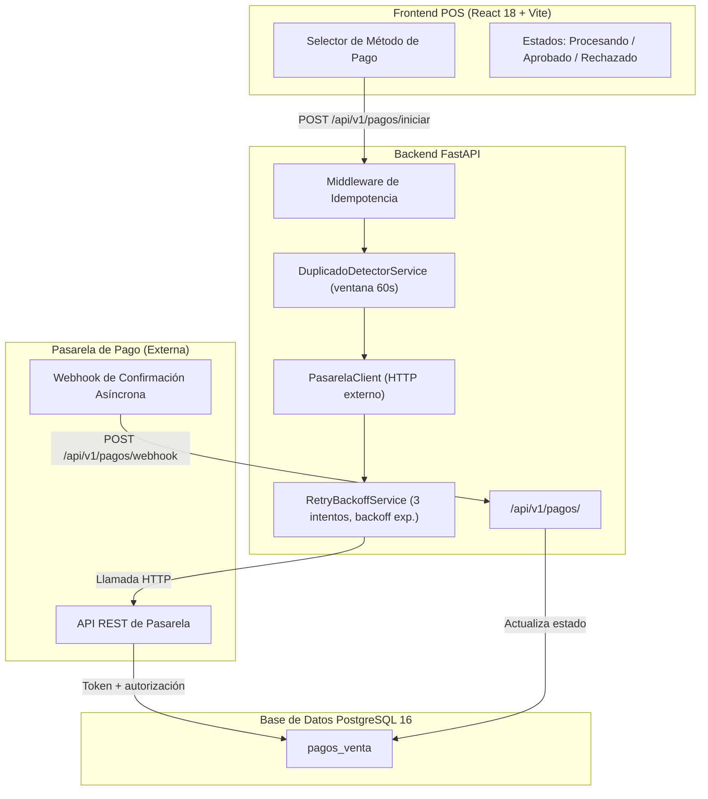

# Plan de Implementación Técnica: 007 - Pagos y Seguridad de Transacciones

**Módulo:** 007-pagos-seguridad  
**Objetivo:** Implementar la integración con pasarela de pago, la idempotencia de cobros, la tokenización de tarjetas y el manejo de reintentos con backoff exponencial.

---

## 1. Arquitectura de Componentes

---

## 2. Fases de Implementación

### Fase 1: Tabla PAGO_VENTA y Modelos
- La tabla `pagos_venta` almacena el resultado de cada intento de cobro con tokenización y sin datos de tarjeta sensibles.
- El campo `idempotency_key = folio_ticket + metodo_pago` garantiza que un mismo cobro no se procese dos veces.

### Fase 2: Middleware de Idempotencia
- El cliente envía el header `Idempotency-Key` en cada solicitud de pago.
- El middleware busca en `pagos_venta` si ya existe un registro con ese `idempotency_key`:
  - Si existe y está `CONFIRMADO`: devuelve la respuesta original almacenada (HTTP 200).
  - Si existe y está `PENDIENTE_CONFIRMACION`: devuelve HTTP 202 indicando que el proceso está en curso.
  - Si no existe: procede con el flujo normal.

### Fase 3: Integración con Pasarela
- El backend actúa de proxy entre el POS y la pasarela: el número de tarjeta **nunca transita por el servidor Quantix**; la pasarela devuelve un `token_tarjeta` y los `ultimos_4_digitos`.
- Manejo de reintentos: `RetryBackoffService` realiza hasta 3 intentos con backoff exponencial (1s, 2s, 4s). Si los 3 fallan, registra `ERR-PAG-01` en `AUDITORIA_EVENTO`.

### Fase 4: Detección de Pagos Duplicados
- `DuplicadoDetectorService` verifica si existe algún `pagos_venta` con el mismo `idempotency_key` creado en los últimos 60 segundos.
- Si detecta un duplicado, rechaza la solicitud con código `ERR-PAG-02` sin llamar a la pasarela.

### Fase 5: Webhook de Confirmación Asíncrona
- La pasarela envía la confirmación final al endpoint `POST /api/v1/pagos/webhook` con la `referencia_transaccion`.
- El backend actualiza `pagos_venta.estado_pago` a `CONFIRMADO` o `RECHAZADO` según la respuesta.
- El webhook debe validar la firma HMAC provista por la pasarela antes de procesar el payload.

---

## 3. Dependencias

| Módulo | Motivo |
|--------|--------|
| **001-core-ventas-inventario** | El `folio_ticket` de la venta es parte del `idempotency_key` y se asocia al pago. |
