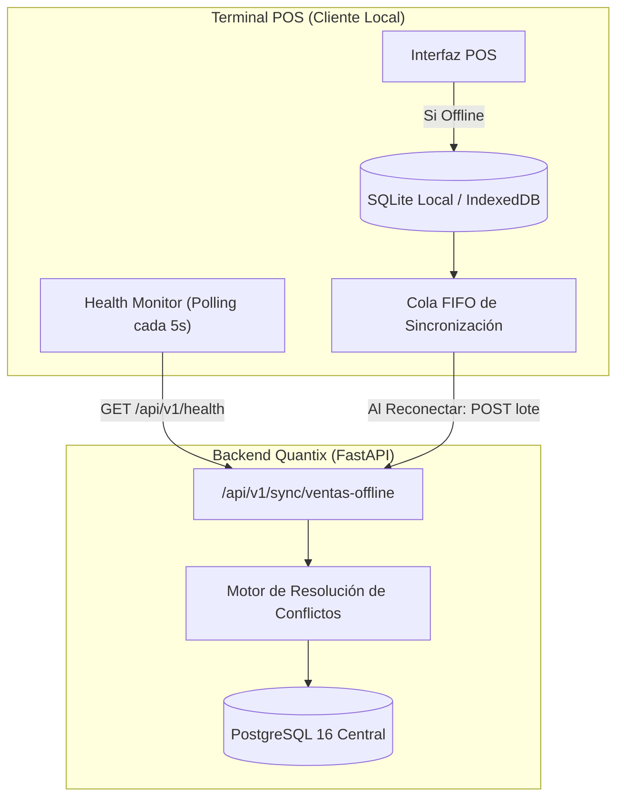

# Plan de Implementación Técnica: 008 - Operación Offline-First y Sincronización

**Módulo:** 008-offline-sync  

---

## 1. Arquitectura de Sincronización

---

## 2. Componentes Clave

1. **Monitor de Conectividad (Heartbeat):**
   * Petición periódica `GET /api/v1/health` cada 5 segundos con timeout de 2 segundos.
   * Dos fallos consecutivos activan inmediatamente el *Modo Offline*.
2. **Caché Local de Catálogo:**
   * Al iniciar el turno y cada vez que hay red activa, la terminal descarga un snapshot de `productos_cache` (id, codigo_barras, nombre, precio_venta).
3. **Modo Degradado en Caja:**
   * Solo permite cobro en `EFECTIVO`.
   * Deshabilita pagos con tarjeta y consultas remotas a la base de fidelización.
4. **Cola de Lotes y Procesamiento Idempotente:**
   * El endpoint `/api/v1/sync/ventas-offline` recibe un arreglo de transacciones con UUIDs locales.
   * Si una transacción ya fue procesada (reintento por red intermitente), el backend responde con su confirmación sin duplicarla.
