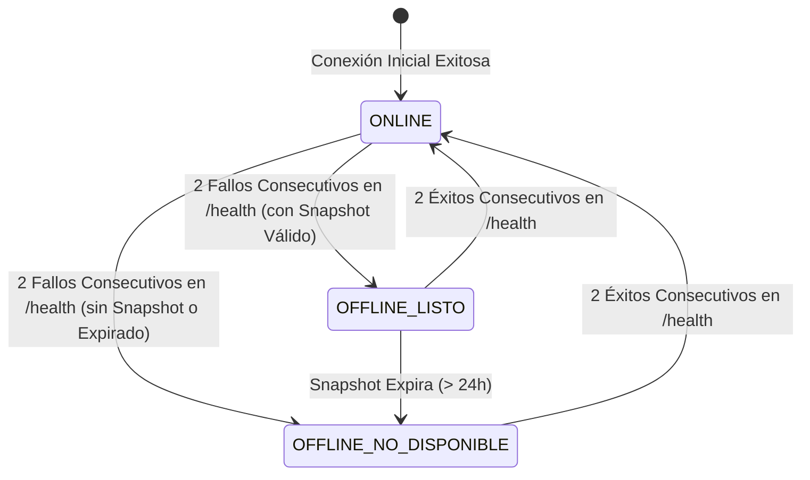

# Especificación Funcional: 008 - Operación Offline-First y Sincronización

**Módulo:** 008-offline-sync  
**Nivel Organizacional:** Operativo (TPS / POS)  
**Estado:** IMPLEMENTADO / VERIFICADO  
**Dependencias:** 001-core-ventas-inventario, 007-pagos-seguridad  
**Verificación de Calidad:** 73 pruebas backend aprobadas (pytest), suite frontend aprobada (vitest), 0 advertencias en linter (oxlint) y build Vite aprobado.

---

## 1. Declaración del Problema y Objetivos

En el comercio físico minorista, una interrupción en el suministro de internet o una indisponibilidad temporal del backend central no debe paralizar la línea de cajas. La pérdida de conectividad no puede resultar en clientes abandonando sus carritos ni en el registro de datos contables o fiscales ficticios.

Este módulo implementa una arquitectura **Offline-First determinista y segura** que garantiza:
1. **Continuidad operativa en caja:** Cobro continuo de artículos en efectivo utilizando un snapshot local validado del catálogo.
2. **Cero datos inventados:** Ausencia absoluta de folios fiscales falsos, stock ficticio o pasarelas de pago simuladas en local.
3. **Persistencia durable:** Almacenamiento local transaccional que sobrevive al cierre del navegador o recarga de pestaña.
4. **Sincronización FIFO e idempotente:** Envío secuencial ordenado por marca de tiempo al restablecerse el enlace, con clave idempotente única por venta (`id_local` UUID v4).
5. **Autoridad central del servidor:** El servidor valida y recalcula precios, impuestos y asignación FEFO; jamás genera stock negativo.
6. **Supervisión de conflictos e interfaz unificada:** Bitácora interactiva de incidencias en `Operaciones.tsx` y feedback al usuario mediante la píldora de conectividad en header y notificaciones toast flotantes no invasivas.

---

## 2. Decisiones Arquitectónicas Fundamentales (ADRs)

### 2.1 Persistencia Local: IndexedDB Nativo (`quantix_offline_db` v1)
- **Decisión:** Implementar el almacenamiento local mediante la API nativa de **IndexedDB** (`quantix_offline_db` v1) con almacenes: `catalogo`, `ventas`, `cola_sync`, `metadata`.
- **Racional:** Evita incorporar binarios pesados WASM (SQLite), reduce el tiempo de arranque en terminales de caja, y ofrece transacciones ACID locales resistentes a cierres de pestaña.

### 2.2 Exclusividad Estricta de Cobro en EFECTIVO
- **Decisión:** En modo offline, el terminal POS deshabilita forzosamente los métodos de pago electrónicos (TARJETA, QR, TRANSFERENCIA) y restringe la operación al cobro en **EFECTIVO**.
- **Racional:** Los cobros electrónicos requieren conexión activa con pasarelas bancarias para tokenización y validación de fondos. Cobrar con tarjeta en desconexión generaría riesgo inaceptable de contracargos.

### 2.3 Autoridad de Servidor y Cero Stock Negativo
- **Decisión:** El backend no confía en los cálculos del cliente; recalcula precios vigentes, IVA 16% (`ROUND_HALF_UP`) y asignación FEFO al recibir el lote en `POST /api/v1/sync/ventas-offline`.
- **Racional:** Si el stock central se agotó durante el corte de red, el servidor **NUNCA** descuenta stock ficticio ni genera existencias negativas. Registra la transacción como `PENDIENTE_REVISION` y genera un registro en `incidencias_sync` (`STOCK_INSUFICIENTE`) para resolución manual por supervisión.

### 2.4 Comprobante Offline Explícito
- **Decisión:** En modo offline se emite un ticket térmico con la leyenda `COMPROBANTE OFFLINE / PENDIENTE DE SINCRONIZACIÓN` y se referencia el `ID LOCAL` (UUID v4), evitando folios fiscales correlativos falsos.

### 2.5 Cola FIFO con Web Locks API (`quantix_sync_lock`)
- **Decisión:** El worker de sincronización en segundo plano coordina la exclusividad entre múltiples pestañas mediante `navigator.locks.request('quantix_sync_lock')`. Aplica backoff exponencial con jitter aleatorio ante fallos de red y detención ante errores 4xx.

---

## 3. Estados Operativos de Conectividad y Feedback UI

La aplicación transiciona entre 3 estados administrados por `connectivityStore` con histéresis anti-oscilación:



1. **`ONLINE`:**
   - Heartbeat activo en `GET /health` y WebSocket conectado.
   - Píldora verde en cabecera con latencia en ms.
   - Catálogo local en IndexedDB actualizado en background.
2. **`OFFLINE_LISTO`:**
   - 2 fallos consecutivos de red pero snapshot vigente (< 24h).
   - Píldora ámbar en cabecera. Notificación flotante inicial (Toast) informando operación exclusiva en efectivo.
   - Cobro continuo en **EFECTIVO** y búsqueda sobre IndexedDB.
3. **`OFFLINE_NO_DISPONIBLE`:**
   - Sin conexión y snapshot inexistente o caducado.
   - Píldora roja en cabecera y notificación toast de advertencia. Checkout bloqueado.

---

## 4. Supervisión de Conflictos e Incidencias (`Operaciones.tsx`)

El módulo de Operaciones (`/operaciones`) incorpora la pestaña **"Supervisión de Conflictos Offline"**:
* **KPIs de Sincronización:** Tarjetas con Total de Incidencias, Pendientes de Resolución y Resueltas.
* **Tabla de Conflictos:** Listado en tiempo real (`GET /api/v1/sync/conflictos`) con `id_local`, tipo de conflicto (`STOCK_INSUFICIENTE`), motivo técnico, terminal y fecha.
* **Modal de Resolución Administrativa:** Formulario para registrar la `nota_resolucion` por un usuario con rol `SUPERVISOR` o `DIRECTOR` (`POST /api/v1/sync/conflictos/{id}/resolver`).
* **Exportación CSV:** Descarga formateada de la bitácora de incidencias para auditoría forense.
* **Alertas Globales:** Emisión automática de toasts flotantes al detectar conflictos tras la reconexión.

---

## 5. Historias de Usuario y Criterios de Aceptación Verificados

### Historia 1: Cobro Continuo en Efectivo durante Corte de Red
```gherkin
Escenario: Caída de red y cobro en efectivo
  Dado que el terminal POS pierde conectividad (2 fallos consecutivos a /health)
  Y existe un snapshot local vigente en IndexedDB
  Cuando el cajero inicia una venta
  Entonces la píldora superior cambia a estado OFFLINE_LISTO
  Y se deshabilitan las opciones de pago electrónico (Tarjeta, QR)
  Y el cobro se restringe exclusivamente a EFECTIVO
  Y los productos se buscan instantáneamente sobre el almacén local 'catalogo'.
```

### Historia 2: Sincronización Automática e Idempotencia
```gherkin
Escenario: Sincronización limpia en orden FIFO
  Dado que existen ventas almacenadas en 'cola_sync'
  Cuando el heartbeat detecta 2 respuestas HTTP 200 consecutivas
  Entonces el worker adquiere el Web Lock 'quantix_sync_lock'
  Y envía el lote FIFO a POST /api/v1/sync/ventas-offline
  Y el servidor recalcula precios, IVA 16% y asigna lotes FEFO
  Y la venta se marca como SINCRONIZADA en la terminal con su folio central.

Escenario: Reenvío duplicado por intermitencia de red
  Dado que una venta local con 'id_local' ya fue procesada
  Cuando por timeout el cliente reintenta enviar el mismo lote
  Entonces el backend responde YA_PROCESADA con el 'venta_id' existente
  Y no descuenta stock duplicado ni altera contabilidad.
```

### Historia 3: Detección y Resolución de Conflicto de Stock
```gherkin
Escenario: Conflicto por stock agotado durante desconexión
  Dado que una venta offline incluye artículos cuyo stock se agotó en servidor
  Cuando se procesa en el endpoint de sincronización
  Entonces el backend no descuenta stock ficticio ni crea venta en estado PAGADO
  Y registra VentaOfflineRecibida como PENDIENTE_REVISION
  Y crea una incidencia en incidencias_sync con tipo STOCK_INSUFICIENTE
  Y emite una notificación toast y WebSocket a supervisión.

Escenario: Resolución de incidencia en Operaciones
  Dado una incidencia pendiente en GET /api/v1/sync/conflictos
  Cuando un supervisor envía POST /api/v1/sync/conflictos/{id}/resolver con su nota justificada
  Entonces la incidencia se marca como resuelta = true con resuelto_por y fecha de auditoría.
```
