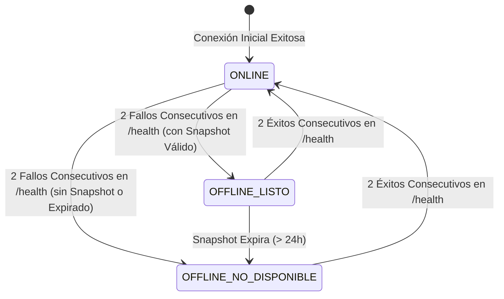

# Especificación Funcional: 008 - Operación Offline-First y Sincronización

**Módulo:** 008-offline-sync  
**Nivel Organizacional:** Operativo (TPS / POS)  
**Estado:** IMPLEMENTADO  
**Dependencias:** 001-core-ventas-inventario, 007-pagos-seguridad  
**Verificación de Calidad:** 73 pruebas backend aprobadas (pytest), 0 advertencias en linter (oxlint) y build Vite aprobado.

---

## 1. Declaración del Problema y Objetivos

En el comercio físico minorista, una interrupción en el suministro de internet o una indisponibilidad temporal del backend central no debe paralizar la línea de cajas. La pérdida de conectividad no puede resultar en clientes abandonando sus carritos ni en el registro de datos contables o fiscales ficticios.

Este módulo implementa una arquitectura **Offline-First determinista y segura** que garantiza:
1. **Continuidad operativa en caja:** Cobro continuo de artículos en efectivo utilizando un snapshot local validado del catálogo.
2. **Cero datos inventados:** Ausencia absoluta de folios fiscales falsos, stock ficticio o pasarelas de pago simuladas en local.
3. **Persistencia durable:** Almacenamiento local transaccional que sobrevive al cierre del navegador o recarga de pestaña.
4. **Sincronización FIFO e idempotente:** Envío secuencial ordenado por marca de tiempo al restablecerse el enlace, con clave idempotente única por venta.
5. **Autoridad central del servidor:** El servidor valida y recalcula precios, impuestos y asignación FEFO; jamás genera stock negativo.

---

## 2. Decisiones Arquitectónicas Fundamentales (ADRs)

### 2.1 Persistencia Local: IndexedDB Nativo vs. SQLite Web/WASM
- **Decisión:** Implementar el almacenamiento local mediante la API nativa de **IndexedDB** (`quantix_offline_db` v1) en lugar de compilar SQLite en WebAssembly (WASM).
- **Racional:**
  - *Rendimiento y Bundle:* Evita incorporar entre 2 y 5 MB de binarios WASM al bundle del cliente, reduciendo sustancialmente el First Contentful Paint (FCP) y el consumo de memoria en terminales ligeras.
  - *Compatibilidad y Estabilidad:* IndexedDB está soportado de forma universal en todos los motores de navegación modernos (Chromium, Gecko, WebKit) sin requerir encabezados especiales de aislamiento de origen (`Cross-Origin-Opener-Policy` / `Cross-Origin-Embedder-Policy` requeridos por `SharedArrayBuffer` en SQLite WASM).
  - *Transaccionalidad:* Provee aislamiento transaccional nativo (`readwrite` / `readonly`) y soporte estructurado para índices secundarios (`sku`, `nombre`, `estado`, `creado_en`).

### 2.2 Exclusividad Estricta de Cobro en EFECTIVO
- **Decisión:** En modo offline, el terminal POS deshabilita de manera forzosa los métodos de pago electrónicos (TARJETA, QR, TRANSFERENCIA) y restringe la operación al cobro en **EFECTIVO**.
- **Racional:** Los cobros con tarjeta y medios digitales requieren validación en línea de fondos, tokens de autorización bancaria y conciliación contra pasarelas de pago (requisito RNF-SEG-02). Permitir pagos diferidos con tarjeta sin conexión generaría un riesgo inaceptable de contracargos y fraudes.

### 2.3 Autoridad de Servidor: Validación, Recálculo y Asignación FEFO
- **Decisión:** El backend **no confía** en los subtotales, precios unitarios, tasas de impuesto ni asignaciones de lote calculados por el cliente.
- **Racional:**
  - Al recibir el lote offline en `POST /api/v1/sync/ventas-offline`, el servidor consulta el catálogo central activo y recalcula el precio vigente de cada producto, computando el impuesto de ley (IVA 16%) con redondeo estándar a centavos (`ROUND_HALF_UP`).
  - La asignación de inventario se realiza en el backend aplicando estrictamente el motor determinista **FEFO** (First Expired, First Out) sobre lotes activos no caducados.
  - **Política de Cero Stock Negativo:** Si durante el corte de red el stock del servidor se agotó o caducó por ventas en otras cajas, el backend **NUNCA** descuenta stock ficticio ni permite stock negativo. En su lugar, marca la transacción como `PENDIENTE_REVISION`, no crea registro en la tabla `ventas` y genera una `IncidenciaSync` (`STOCK_INSUFICIENTE`) para intervención auditada de supervisión.

### 2.4 Comprobante Offline Explícito vs. Folio Fiscal Central
- **Decisión:** En modo offline se imprime un comprobante con la leyenda explícita `COMPROBANTE OFFLINE / PENDIENTE DE SINCRONIZACIÓN` y se referencia el `ID LOCAL` (UUID v4).
- **Racional:** Evita la emisión fraudulenta o errónea de folios fiscales correlativos (`TKT-YYYYMMDD-XXXXXX`), los cuales son prerrogativa exclusiva del servidor central con control secuencial atómico.

### 2.5 Cola FIFO con Web Locks API y Backoff Exponencial con Jitter
- **Decisión:** El procesamiento de sincronización en segundo plano coordina la exclusividad entre múltiples pestañas del navegador utilizando `navigator.locks.request('quantix_sync_lock')`.
- **Racional:** Previene que dos pestañas abiertas de la misma terminal envíen simultáneamente el mismo lote offline. Ante fallos de red o respuestas 5xx, el worker aplica backoff exponencial con jitter aleatorio (hasta 60s) y se suspende de inmediato ante errores funcionales 4xx (como token no autorizado o sesión cerrada) sin provocar bucles infinitos.

---

## 3. Estados Operativos de Conectividad

La aplicación transiciona entre 3 estados administrados por `connectivityStore` con histéresis anti-oscilación:



1. **`ONLINE`:**
   - Comunicación bidireccional activa con API (`GET /health` responde HTTP 200) y WebSocket conectado.
   - Venta multimodal habilitada (efectivo, tarjeta, QR, CRM, cupones).
   - El catálogo local en IndexedDB se refresca automáticamente en segundo plano.
2. **`OFFLINE_LISTO`:**
   - Dos fallos consecutivos en heartbeat pero existe un snapshot local válido en IndexedDB (< 24 horas de antigüedad).
   - Banner ámbar persistente visible con contador de ventas pendientes.
   - Cobro habilitado exclusivamente en **EFECTIVO**.
   - Búsqueda instantánea desde el store `catalogo` de IndexedDB.
   - Persistencia atómica local en `ventas` y `cola_sync`.
3. **`OFFLINE_NO_DISPONIBLE`:**
   - Falla de conexión confirmada y no existe catálogo local o ha expirado.
   - Banner rojo persistente en pantalla.
   - Checkout bloqueado por completo para evitar ventas sin base de precios confiable.

---

## 4. Historias de Usuario y Criterios de Aceptación Verificados

### Historia 1: Cobro Continuo durante Corte de Red
* **Como** cajero del punto de venta,  
* **Quiero** seguir registrando ventas y cobrando en efectivo cuando cae internet,  
* **Para** no detener el servicio ni perder ventas.

#### Criterios de Aceptación (Gherkin):
```gherkin
Escenario: Caída de red y activación de modo degradado
  Dado que el terminal POS pierde conectividad con el servidor central (2 fallos consecutivos a /health)
  Y existe un snapshot local vigente en IndexedDB
  Cuando el cajero inicia o continúa una venta
  Entonces la interfaz muestra un banner superior ámbar indicando "Modo Offline Seguro"
  Y deshabilita las opciones de pago con tarjeta, transferencia y QR
  Y restringe el cobro exclusivamente a EFECTIVO
  Y realiza la búsqueda de productos sobre el almacén local 'catalogo'.

Escenario: Registro de venta offline con persistencia durable
  Dado que el terminal está operando en estado OFFLINE_LISTO
  Cuando el cajero finaliza el cobro en efectivo
  Entonces la venta, sus partidas y la entrada en la cola se guardan en una transacción atómica en IndexedDB
  Y se muestra el modal del ticket con la leyenda "COMPROBANTE OFFLINE / PENDIENTE DE SINCRONIZACIÓN"
  Y el comprobante expone el ID LOCAL (UUID) y advierte que la asignación FEFO y folio fiscal ocurrirán al sincronizar
  Y la recarga del navegador o cierre de pestaña no pierde la venta almacenada.
```

---

### Historia 2: Sincronización Automática e Idempotencia
* **Como** administrador y supervisor de tienda,  
* **Quiero** que las ventas offline se transmitan en orden FIFO al restaurarse la red,  
* **Para** mantener el inventario y las finanzas consolidadas sin duplicación.

#### Criterios de Aceptación (Gherkin):
```gherkin
Escenario: Sincronización limpia sin conflicto de inventario
  Dado que existen ventas almacenadas en el almacén 'cola_sync'
  Y el backend central dispone de stock suficiente en lotes vigentes
  Cuando el heartbeat detecta 2 respuestas HTTP 200 consecutivas
  Entonces el worker adquiere el Web Lock ('quantix_sync_lock')
  Y despacha el lote en orden cronológico FIFO a POST /api/v1/sync/ventas-offline
  Y el servidor recalcula precios, IVA 16% y asigna lotes por algoritmo FEFO
  Y crea la Venta central con estado PAGADO y folio fiscal legítimo
  Y la terminal marca la venta local como 'SINCRONIZADA' con su folio central.

Escenario: Reenvío concurrente o duplicado (Idempotencia)
  Dado que una venta local con 'id_local' UUID ya fue sincronizada exitosamente
  Cuando por reintento de red se envía nuevamente el mismo 'id_local'
  Entonces el backend reconoce la restricción uq_ventas_offline_id_local
  Y responde con estado 'YA_PROCESADA' junto con el 'venta_id' y 'folio_ticket' existentes
  Y el stock de inventario no sufre descuento duplicado.
```

---

### Historia 3: Detección y Resolución Auditada de Conflictos
* **Como** supervisor de tienda,  
* **Quiero** supervisar y auditar ventas offline con quiebre de stock,  
* **Para** garantizar que nunca se genere inventario negativo y exista trazabilidad administrativa.

#### Criterios de Aceptación (Gherkin):
```gherkin
Escenario: Conflicto por stock agotado durante desconexión
  Dado que una venta offline incluye artículos cuyo stock en servidor se agotó durante el corte
  Cuando se procesa en el endpoint POST /api/v1/sync/ventas-offline
  Entonces el backend rechaza la creación de una Venta central
  Y NUNCA genera stock negativo en lotes de inventario
  Y registra VentaOfflineRecibida con estado 'PENDIENTE_REVISION'
  Y genera un registro en 'incidencias_sync' con tipo 'STOCK_INSUFICIENTE'
  Y emite una notificación vía WebSocket a los supervisores.

Escenario: Supervisión y resolución auditada de incidencia
  Dado que existe una incidencia de sincronización no resuelta
  Cuando un usuario con rol SUPERVISOR o DIRECTOR accede a GET /api/v1/sync/conflictos
  Entonces visualiza el detalle del quiebre con el id_local y terminal
  Y al enviar POST /api/v1/sync/conflictos/{id}/resolver con su justificación
  Entonces la incidencia se marca como resuelta=True
  Y se audita resuelto_por, resuelto_en y nota_resolucion.
```

