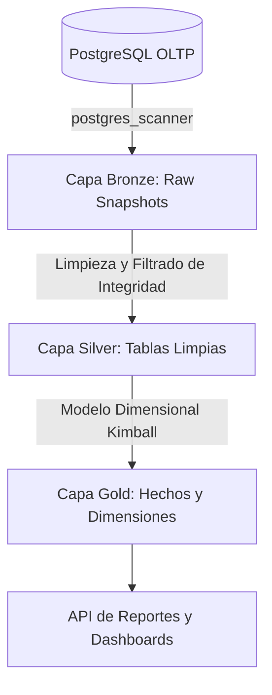

# Especificación Funcional: 009 - Pipeline ETL Medallion y Almacén Analítico DuckDB

**Módulo:** 009-etl-medallion  
**Nivel Organizacional:** Transversal (Soporte Táctico y Estratégico OLAP)  
**Estado:** IMPLEMENTADO / VERIFICADO  
**Dependencias:** 001-core-ventas-inventario, 002-clientes-fidelizacion, 003-precios-margenes  
**Documento maestro:** [docs/arquitectura/etl_medallion_architecture.md](file:///c:/Users/kacor/OneDrive/Desktop/Quantix/docs/arquitectura/etl_medallion_architecture.md)

---

## 1. Declaración del Problema y Objetivos
Las consultas analíticas masivas (agregaciones históricas, segmentación RFM, Pareto ABC, matrices de estacionalidad y proyecciones Z/t) consumen un alto volumen de CPU y memoria. Si se ejecutasen directamente sobre la base transaccional PostgreSQL (OLTP), provocarían degradación de latencia y bloqueos en las cajas registradoras.

Este módulo implementa el pipeline de extracción, transformación y carga (ETL) bajo la arquitectura **Medallion (Bronze / Silver / Gold)** utilizando el motor columnar embebido **DuckDB** (`quantix_analytics.duckdb`):
* Desacoplamiento total entre transacciones operativas y consultas de Business Intelligence.
* Extracción directa y de alta velocidad mediante la extensión nativa `postgres_scanner` de DuckDB sin necesidad de microservicios externos ni brokers pesados.
* Orquestación asíncrona mediante **APScheduler** (`AsyncIOScheduler`) embebido en FastAPI con soporte para reprogramación en caliente y disparos manuales.
* Modelo dimensional Kimball en la capa Gold con 5 dimensiones (`dim_tiempo`, `dim_producto`, `dim_cliente`, `dim_cajero`, `dim_sucursal`) y 2 tablas de hechos (`fact_ventas` a nivel de línea y `fact_pagos`).
* Panel de control y monitoreo administrativo en `Operaciones.tsx` con trazabilidad completa en la tabla relacional `etl_log`.

---

## 2. Arquitectura de Tres Capas (Medallion en DuckDB)



### 2.1 Capa Bronze (Raw Ingestion)
Vistas estructuradas que replican las tablas transaccionales de PostgreSQL:
* `bronze.venta`, `bronze.detalle_venta`, `bronze.producto`, `bronze.cliente`, `bronze.usuario`, `bronze.sucursal`, `bronze.sesion_caja`, `bronze.pagos_venta`, `bronze.categoria_producto`.

### 2.2 Capa Silver (Data Cleansing & Conformity)
Vistas normalizadas que excluyen ventas no completadas o registros dados de baja:
* `silver.venta_limpia`: Filtra `estado = 'COMPLETADA'`.
* `silver.producto_activo`: Filtra `activo = true`.
* `silver.cliente_limpio`: Datos maestros unificados con cédula y teléfono válidos.
* `silver.usuario_activo` y `silver.sucursal_activa`.

### 2.3 Capa Gold (Dimensional Analytics)
Tablas físicas optimizadas para lecturas agregadas por parte de `Analisis.tsx` y `Dashboard.tsx`:
* **Dimensiones:**
  - `gold.dim_tiempo`: Calendario enriquecido (año, mes, semana, día de semana, hora).
  - `gold.dim_producto`: SKU, nombre, categoría, clasificación ABC, precio de venta, costo base.
  - `gold.dim_cliente`: Cédula, nombre, teléfono, puntos acumulados, sucursal de origen.
  - `gold.dim_cajero`: Nombre de usuario, email, rol, sucursal asignada.
  - `gold.dim_sucursal`: Código, nombre, ciudad, dirección.
* **Hechos:**
  - `gold.fact_ventas`: Granularidad por renglón de detalle con `sucursal_id`, `cajero_id`, `sesion_caja_id`, `cliente_id`, `producto_id`, cantidad vendida, subtotal, descuentos, impuestos y margen de ganancia.
  - `gold.fact_pagos`: Transacciones por método de pago (`EFECTIVO`, `TARJETA`, `TRANSFERENCIA`, `QR`, `CUPON`).

---

## 3. Orquestación, Scheduler y Disparo Manual

1. **Planificación Automática:**
   - Job Micro-batch (cada 5 minutos): Sincroniza ventas y lotes hacia DuckDB.
   - Job de Alertas Predictivas (cada 15 minutos): Evalúa umbrales de reorden y caducidad FEFO.
2. **Reprogramación Dinámica (`POST /api/v1/operaciones/etl/reprogramar`):**
   - El rol `DIRECTOR` puede ajustar la frecuencia del job en caliente sin reiniciar la aplicación.
3. **Disparo Manual desde Frontend (`Operaciones.tsx`):**
   - Botón "Ejecutar Pipeline Manual Ahora" que invoca `POST /api/v1/operaciones/etl/ejecutar`.
   - Registra el tipo de disparo (`MANUAL` o `PROGRAMADO`), usuario ejecutor, duración en milisegundos y filas transformadas en `etl_log`.

---

## 4. Historias de Usuario y Criterios de Aceptación Verificados

### Historia 1: Sincronización Medallion Exitosa
```gherkin
Escenario: Ejecución de pipeline ETL y actualización de DuckDB Gold
  Dado que existen nuevas ventas completadas en PostgreSQL
  Cuando se dispara el pipeline ETL (programado o manual)
  Entonces DuckDB refresca las capas Bronze y Silver vía postgres_scanner
  Y recalcula las tablas físicas gold.fact_ventas y gold.fact_pagos
  Y registra una fila en etl_log con estado = 'EXITOSO' y el recuento de filas procesadas.
```

### Historia 2: Aislamiento por Sucursal en Capa Gold
```gherkin
Escenario: Consulta analítica filtrada por sucursal desde gold.fact_ventas
  Dado que un Supervisor de Sucursal Norte consulta métricas analíticas
  Cuando el backend consulta DuckDB Gold con WHERE sucursal_id = :norte_id
  Entonces DuckDB devuelve exclusivamente la facturación y márgenes de la sede Norte
  Y el tiempo de agregación es inferior a 100 ms.
```
