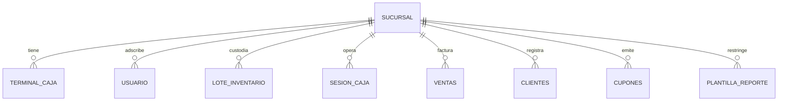

# Especificación Funcional: 013 - Soporte Multi-Sucursal, Terminales y Sincronización Reactiva

**Módulo:** 013-multi-sucursal  
**Nivel Organizacional:** Transversal (Infraestructura Multi-Tenant Lógica)  
**Estado:** IMPLEMENTADO / VERIFICADO  
**Dependencias:** 001-core-ventas-inventario, 010-auth-usuarios  

---

## 1. Declaración del Problema y Objetivos
El crecimiento de una cadena minorista requiere operar múltiples tiendas físicas bajo una infraestructura tecnológica centralizada, garantizando que cada local mantenga la independencia operativa de sus terminales de caja, su inventario físico y sus arqueos, mientras la Dirección General dispone de una visión consolidada del negocio.

Este módulo implementa la arquitectura multi-sucursal de Quantix:
* Modelo relacional multi-sucursal soportado por las entidades `sucursal` y `terminal_caja` (Alembic 0008).
* Existencia de una sede matriz predeterminada inmutable (`00000000-0000-0000-0000-000000000001`).
* Desacoplamiento de existencias: cada lote de inventario (`lote_inventario`) pertenece a una `sucursal_id` específica.
* Aislamiento estricto de transacciones: sesiones de caja (`sesion_caja`), ventas (`ventas`), clientes (`clientes`) y cupones (`cupones`) quedan territorialmente acotados a su sede física.
* **Control de Acceso RBAC y Aislamiento Estricto:**
  - Los roles operativos y tácticos (`SUPERVISOR`, `CAJERO`, `BODEGUERO`) están estrictamente restringidos a su `sucursal_id` asignada. El backend rechaza con **HTTP 403 Forbidden** cualquier intento de acceso foráneo.
  - El rol `DIRECTOR` posee privilegios globales para consultar todas las sedes de forma consolidada o alternar individualmente entre ellas.
* **Sincronización Reactiva en Frontend (`useSucursalStore`):**
  - Store global persistente (`quantix-sucursal-storage`) que expone `sucursalActual` y el catálogo de sedes.
  - Selector de sede en la barra superior (`Layout.tsx`): selector interactivo para directores y badge con candado visual fijo para supervisores y cajeros.
  - Propagación reactiva: todas las pantallas del sistema (`POS`, `Inventario`, `Clientes`, `Tactico`, `Analisis`, `Dashboard`) se suscriben al cambio de `sucursalActual`, recargando inmediatamente sus consultas y datasets sin recargar la página.

---

## 2. Arquitectura de Datos y Relaciones Multi-Sede



---

## 3. Historias de Usuario y Criterios de Aceptación Verificados

### Historia 1: Conmutación Reactiva de Sede por Dirección General
* **Como** director general,  
* **Quiero** cambiar de sucursal en el selector del encabezado y ver los datos de esa sede inmediatamente en la pantalla activa,  
* **Para** auditar las operaciones de cualquier tienda física sin navegar fuera del módulo.

#### Criterios de Aceptación (Gherkin):
```gherkin
Escenario: Cambio de sucursal en módulo de Análisis y Reportes
  Dado que el usuario autenticado tiene rol DIRECTOR y está en /analisis con Sucursal Matriz activa
  Cuando selecciona "Sucursal Norte" en el selector de sucursales del Header
  Entonces useSucursalStore actualiza sucursalActual
  Y Analisis.tsx detecta el cambio en su useEffect
  Y vuelve a consultar /reportes/analisis/kpis-avanzados, tendencias y Pareto con sucursal_id = norte_uuid
  Y los gráficos y KPIs se refrescan en pantalla con los datos exclusivos de Sucursal Norte.
```

### Historia 2: Restricción y Candado Visual para Supervisores
* **Como** supervisor de tienda,  
* **Quiero** tener fija mi sucursal asignada en el sistema,  
* **Para** asegurar que mis arqueos, inventarios y personal correspondan exclusivamente a mi tienda.

#### Criterios de Aceptación (Gherkin):
```gherkin
Escenario: Supervisor con candado visual e intento forzado de override
  Dado un usuario autenticado con rol SUPERVISOR asignado a Sucursal Sur
  Cuando accede al sistema
  Entonces el Header muestra el nombre de "Sucursal Sur" con un icono de candado bloqueado
  Y las funciones seleccionarSucursal() del store ignoran cualquier llamada no directiva
  Y si envía una petición HTTP con sucursal_id de otra sede el backend responde HTTP 403 Forbidden.
```

---

## 4. Requisitos No Funcionales del Módulo
* **Persistencia Local:** La sucursal seleccionada por el director se memoriza en `localStorage` (`quantix-sucursal-storage`) para mantenerse activa tras recargas del navegador.
* **Integridad Referencial:** Restricción `ON DELETE RESTRICT` en todas las claves foráneas hacia `sucursal` para impedir el borrado accidental de sedes con transacciones históricas.
